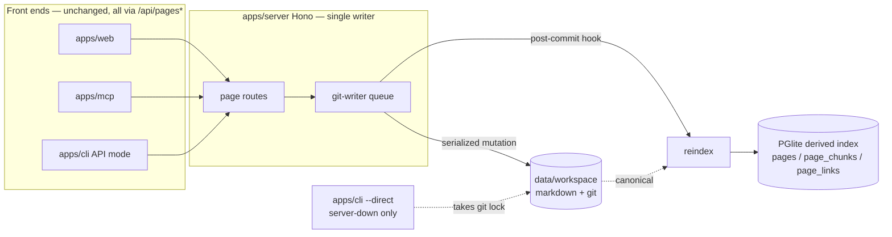
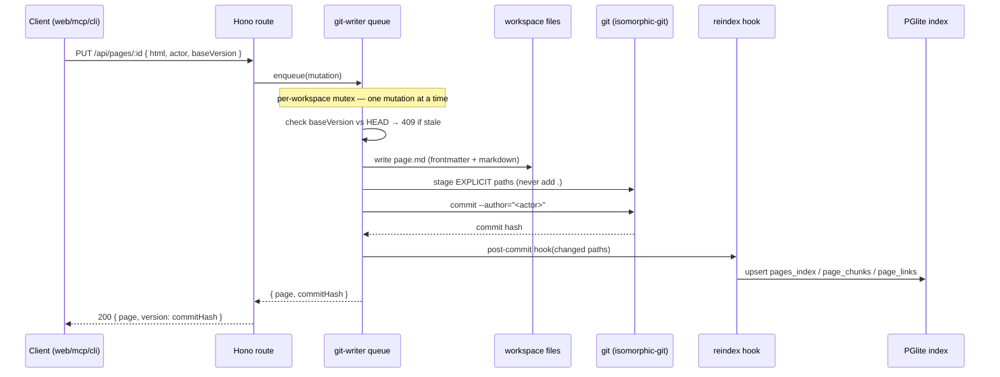

# refactor: Markdown-First, Files+Git Canonical — Phase 0 + Phase 1

## Summary

Invert Company Brain's storage so that **markdown files in a git repo are the canonical source of
truth** and PGlite becomes a **rebuildable derived index**. This plan covers the two concrete, next-up
phases in full detail and outlines Phases 2–5 as milestones:

- **Phase 0 — the single-writer git serializer** (the linchpin). A new `@company-brain/git-writer`
  package: a server-owned, serialized write queue that stages explicit paths and commits with author
  attribution, plus history/diff/restore over git. Built and tested standalone, not yet wired to pages.
- **Phase 1 — invert page storage.** A new `@company-brain/workspace` package (markdown file IO,
  frontmatter, HTML↔markdown conversion) and a rewrite of the page store so mutations write markdown
  files through the git queue, with the DB (`pages`/`page_chunks`/`page_links`) rebuilt by a `reindex`
  pass in a post-commit hook. The public store API stays stable, so the server/MCP/CLI/web surfaces are
  largely untouched.

The memory layer, comments/permissions, MCP+CLI surface, and one-container default stay intact
throughout. Git lineage (attributed, reconstructible commits) becomes a first-class feature.

---

## Problem Frame

Today the DB is canonical: pages are sanitized HTML stored in `pages.html` (PGlite), and the
`apps/server` Hono app has **zero concurrency control** — routes call store methods directly. This has
two consequences the refactor targets:

1. **No portability / no lineage substrate.** Content is locked in a Postgres cluster; there is no
   git history, no agent-readable file tree, no "git-backed brain mirror."
2. **Lock contention is empirically real.** Because CLI `--direct` and the running server each open
   their own PGlite connection and lock, the working `data/` dir currently holds 11
   `pgdata.company-brain.lock.stale-*` directories plus `pgdata.broken-*` / `pgdata.bak-*` copies.

The post-pivot direction (see `origin`) makes files+git canonical and the DB derived. The enabling
piece neither Cabinet (single-writer) nor GBrain (solo) has solved is a **server-side single writer to
the git working tree** that serializes commits while remaining multi-user — that is Phase 0, and
everything else depends on it.

---

## Requirements

Traced to the origin spec (`docs/refactor-markdown-first-spec.md`).

- **R1** — Markdown + YAML frontmatter is the page storage format; a stable frontmatter `id` (UUID)
  survives renames/moves. (spec §2.1)
- **R2** — Files on disk + git are canonical; PGlite is a rebuildable derived index. A corrupted index
  must be recoverable via `reindex` from the workspace alone. (spec §1, §3)
- **R3** — The Hono server is the **single writer** to the git working tree; all mutations are
  serialized, permission-checked, and attributed. No writes bypass it. (spec §4)
- **R4** — Git auto-commit stages **explicit paths only** (never `git add .`) and only into a repo the
  app created (a `managed` marker). Commits carry author attribution. (spec §4, §9)
- **R5** — Page history/diff/restore is backed by git (`log`/`diff`/`checkout`), replacing HTML
  snapshots. (spec §9)
- **R6** — Concurrent edits resolve via optimistic concurrency (client sends a base version; server
  rejects stale writes). CRDT co-editing is explicitly deferred. (spec §4, Collaboration Level 3)
- **R7** — The public page-store API stays stable so `apps/server`, `apps/mcp`, `apps/web`, and CLI
  API-mode need no rewrite; CLI `--direct` is demoted to server-down only. (spec §4.5, §7)
- **R8** — `cb reindex` rebuilds the derived index from the workspace; `cb doctor` additionally checks
  the git working tree and index freshness. (spec §7)
- **R9** — Defend the existing memory layer, comments/versions/share-links/permissions/activity, the
  18-tool MCP + dual-mode CLI, and the one-container default. (spec "DEFEND during refactor")

---

## Key Technical Decisions

- **KTD1 — Git library: `isomorphic-git` (pure JS), not `simple-git`/`nodegit`.** isomorphic-git has no
  native build and no system-`git` dependency, preserving the one-container default and Windows/source
  installs. Tradeoff: slower than shelling to `git` and has some API quirks. **Mitigation: U1 includes a
  validation spike** (commit + log + diff + checkout on a temp repo) before building on it; if it fails
  the bar, fall back to `simple-git` (requires `git` in the container image). *Alternative considered:*
  `simple-git` — simpler and battle-tested, but adds a system dependency that fights the portability goal.
- **KTD2 — Single workspace = one git repo, with path-scoped RBAC.** (locked) One repo at
  `data/workspace/`; permissions enforced by path prefix later in Phase 5. Simpler serializer, backup,
  and search than Cabinet-style per-team "rooms" (deferred). *(origin §10 Q4)*
- **KTD3 — Attachments live in the git repo for the baseline; object storage at scale.** (locked)
  Keeps one-container/one-volume portability; the scale path adds S3/R2 later. *(origin §10 Q5)*
- **KTD4 — Whether extracted memories are DB-canonical or also file-mirrored is OPEN, deferred to
  Phase 2.** It does not affect Phase 0–1. Leaning recorded in Open Questions. *(origin §10 Q3)*
- **KTD5 — HTML↔Markdown: `turndown` (HTML→MD) + `markdown-it` (MD→HTML), `sanitize-html` retained at
  the boundary, `gray-matter` for frontmatter.** The editor still emits HTML; the server converts to
  markdown on write and back to sanitized HTML on read. Sanitization stays exactly where it is today
  (the `prepareHtml` choke point), just relocated around the markdown roundtrip.
- **KTD6 — The derived index reuses today's tables.** `pages` (becomes an index row, not the source of
  truth), `page_chunks`, and `page_links` are already the rebuildable trio; `reindex` repopulates them
  from files. `pages.id` is sourced from frontmatter so `memory_sources.page_id` citations stay stable.
- **KTD7 — Page version history switches to git.** `page_versions` snapshots and `snapshotPage()` are
  retired; the version endpoints repoint to git `log`/`diff`/`checkout`. *(R5)*
- **KTD8 — Optimistic concurrency via a base-version token** (the last commit hash the client saw).
  Stale writes get a typed `WorkspaceConflictError` → HTTP 409. This is Collaboration Level 1; CRDT is
  Level 3, deferred.

---

## High-Level Technical Design

### Component shape after Phase 1



### Serialized write path (the Phase 0 contract)



### File vs DB split (canonical vs derived)

| Concern | Canonical (git) | Derived (PGlite, rebuildable) |
|---|---|---|
| Page body + frontmatter | `data/workspace/pages/**/*.md` | `pages` (index row), `page_chunks`, `page_links` |
| Page history/diff/restore | git `log`/`diff`/`checkout` | — (`page_versions` retired) |
| Comments / share-links / permissions / activity | — | operational tables (unchanged, key off `pages.id`) |
| Memories / citations | OPEN (Phase 2) | `memories`, `memory_sources` |

---

## Output Structure

New packages (mirroring the existing `createXStore(db?)` factory + `exports["."]="./src/index.ts"`
convention):

```
packages/
  git-writer/                 # Phase 0 — greenfield
    package.json
    tsconfig.json
    src/
      index.ts                # createGitWriter(opts) factory: queue + git ops + history
      index.test.ts
  workspace/                  # Phase 1 — greenfield
    package.json
    tsconfig.json
    src/
      index.ts                # createWorkspace(opts): file IO, frontmatter, HTML<->MD, path/slug/id
      index.test.ts
```

Modified: `packages/pages/src/index.ts`, `apps/server/src/index.ts`, `apps/cli/src/index.ts`,
`packages/db/src/index.ts` (migration to drop/deprecate `page_versions` usage), and a one-time
migration script.

---

## Scope Boundaries

### In scope (this plan)
Phase 0 (git-writer package, fully tested standalone) and Phase 1 (workspace package, page-store
inversion, reindex, version-history-on-git, CLI `--direct` demotion, one-time HTML→MD migration).

### Deferred to Follow-Up Work (later phases, outlined below)
- **Phase 2** — memory on the new substrate (re-key citations, entities/profiles, resolve KTD4).
- **Phase 3** — agent runtime + cron (persona.md, `.jobs` YAML, node-cron, provider adapters + CLI
  auto-detection, conversation transcripts).
- **Phase 4** — TEAM/TASKS UI + onboarding wizard; conversation→Kanban projection; DATA/TEAM/TASKS nav.
- **Phase 5** — multi-user hardening: SSO identities, RBAC grants, suggest-changes approval, presence,
  optimistic-concurrency merge UI.

### Out of scope (non-goals)
- CRDT / real-time co-editing (Collaboration Level 3).
- Object storage for attachments (KTD3 — scale mode).
- Cabinet-style per-team "rooms" (KTD2 — single workspace first).
- Any change to the memory recall algorithm (BM25 stays; vectors/pgvector are a later track).

---

## Implementation Units

### Phase 0 — Single-writer git serializer

#### U1. `@company-brain/git-writer` package: repo lifecycle + core git ops
- **Goal:** Greenfield package providing git operations over a workspace dir via isomorphic-git, with
  the explicit-paths-only and managed-repo invariants. Includes the KTD1 validation spike.
- **Requirements:** R4, R5 (ops only; queue is U2).
- **Dependencies:** none.
- **Files:** `packages/git-writer/package.json`, `packages/git-writer/tsconfig.json`,
  `packages/git-writer/src/index.ts`, `packages/git-writer/src/index.test.ts`.
- **Approach:** `createGitWriter({ workspaceDir })` factory (match `createPageStore` style). Ops:
  `ensureRepo()` (init if absent; write a `company-brain.managed` marker to git config; refuse to
  operate on a repo without the marker), `stageAndCommit(paths: string[], message, author)` (stage
  only the listed paths — assert none is `"."`/`"-A"`), `history(relPath)` (git log for a file),
  `diff(hash)`, `restore(hash, relPath)` (checkout a path at a commit, returns content), `status()`.
  isomorphic-git uses `fs` + `dir`; no system git. Add a one-test spike asserting the full
  init→commit→log→diff→checkout cycle works on a temp dir; if it fails, the package swaps to
  `simple-git` behind the same factory interface (decision recorded in the test file header).
- **Patterns to follow:** factory + object-literal-of-async-methods (`packages/pages/src/index.ts`
  `createPageStore`); `randomUUID` from `node:crypto`; ESM + explicit `.ts` imports;
  `package.json` shape from `packages/db/package.json`.
- **Test scenarios:**
  - Happy: `ensureRepo()` on an empty temp dir creates `.git` and the managed marker.
  - Happy: `stageAndCommit(["pages/a.md"], msg, author)` produces one commit; `git log` shows the author and message.
  - Edge: committing two explicit paths stages exactly those two and leaves an untracked third file uncommitted.
  - Error: `stageAndCommit(["."], …)` throws (explicit-paths-only invariant).
  - Error: operating on a pre-existing repo without the managed marker throws.
  - Happy: `history(path)` returns commits newest-first; `diff(hash)` returns the change; `restore(hash, path)` returns the prior content.
  - Spike: init→commit→amend-file→commit→log(2)→diff→checkout round-trips correctly (gates KTD1).
- **Verification:** `pnpm --filter @company-brain/git-writer test` green; the package builds and typechecks; no `git add .` path exists.

#### U2. Serialized single-writer queue + mutation contract
- **Goal:** A per-workspace mutex that serializes mutations and runs each as
  validate → write files → stage explicit paths → commit → post-commit hook → return commit hash.
- **Requirements:** R3, R2 (the reindex hook seam).
- **Dependencies:** U1.
- **Files:** `packages/git-writer/src/index.ts` (extend), `packages/git-writer/src/index.test.ts`.
- **Approach:** `enqueue(mutation: WorkspaceMutation): Promise<MutationResult>` where a mutation
  declares its target paths and a `write()` callback; the queue is a promise-chain mutex (one in
  flight). After a successful commit, invoke an injected `onCommit(changedPaths, hash)` hook (the
  reindex seam — a no-op until U6 wires it). Failures roll back staged changes (reset the working tree
  for the touched paths) and reject without advancing HEAD.
- **Patterns to follow:** keep the queue in-process and per-writer-instance (single workspace, KTD2);
  no external queue dependency (one-container default).
- **Test scenarios:**
  - Happy: two concurrent `enqueue` calls commit in submission order; the second sees the first's commit as HEAD.
  - Integration: a mutation that writes a file then commits fires `onCommit` once with the changed path and the new hash.
  - Error: a mutation whose `write()` throws leaves HEAD unchanged and the working tree clean (no partial commit); the next mutation still succeeds.
  - Edge: an empty mutation (no path changes) does not create an empty commit.
- **Verification:** queue ordering and rollback proven under concurrency; `onCommit` contract exercised.

#### U3. Attribution + optimistic concurrency
- **Goal:** Map an `actor` to a git author and enforce a base-version guard for stale writes.
- **Requirements:** R4, R6, R8.
- **Dependencies:** U2.
- **Files:** `packages/git-writer/src/index.ts` (extend), `packages/git-writer/src/index.test.ts`.
- **Approach:** `Actor = { name, email? }` → git author (fallback `name <name@company-brain.local>`,
  mirroring Cabinet's `agent@cabinet.local` convention). Mutations accept an optional
  `baseVersion` (commit hash); the queue compares it to current HEAD for the touched paths and throws a
  typed `WorkspaceConflictError` when stale. Export the error type for the server to map to HTTP 409.
- **Test scenarios:**
  - Happy: a mutation with `baseVersion === HEAD` commits and returns the new hash.
  - Error: a mutation with a stale `baseVersion` throws `WorkspaceConflictError`; HEAD is unchanged.
  - Happy: agent vs human actors produce distinct, correctly-formatted commit authors.
  - Edge: a mutation with no `baseVersion` (first write / force) commits without the guard.
- **Verification:** conflict detection and author attribution covered by tests; `WorkspaceConflictError` is exported.

---

### Phase 1 — Invert page storage

#### U4. `@company-brain/workspace` package: file IO, frontmatter, HTML↔markdown
- **Goal:** Greenfield package owning the on-disk page layout, frontmatter, markdown↔HTML conversion,
  and path/slug/id resolution — the markdown analogue of today's `prepareHtml`/`preparePageInput`.
- **Requirements:** R1, R5, KTD5.
- **Dependencies:** none (usable independent of git-writer).
- **Files:** `packages/workspace/package.json`, `packages/workspace/tsconfig.json`,
  `packages/workspace/src/index.ts`, `packages/workspace/src/index.test.ts`.
- **Approach:** `createWorkspace({ workspaceDir })`. Functions: `pageFilePath(slugPath)` (directory page
  `pages/<path>/index.md` vs standalone `pages/<path>.md`, Cabinet-style), `readPage`/`writePage`
  (gray-matter frontmatter: `id, title, created, updated, tags, order, visibility, owner`),
  `htmlToMarkdown` (turndown + GFM), `markdownToHtml` (markdown-it), and reuse `sanitize-html` with the
  **existing allowlist** from `packages/pages/src/index.ts` (extract it to a shared helper). Preserve
  `[[wiki-link]]` and `@mention` handling by converting around the markdown boundary. Keep the
  title↔first-`<h1>` sync rule (port `preparePageInput` logic).
- **Patterns to follow:** the sanitize allowlist and link-extraction in `packages/pages/src/index.ts`
  (`prepareHtml` line ~735, `extractInternalAnchorLinks`, `linkPattern`); slug helpers `slugify`/`slugifyPath`.
- **Test scenarios:**
  - Happy: `writePage` then `readPage` round-trips frontmatter + body; `updated` is rewritten on write.
  - Happy: `htmlToMarkdown(markdownToHtml(md))` is stable for headings, lists, tables, code, links.
  - Edge: `<script>` is stripped on the HTML boundary (port the existing sanitization test).
  - Edge: a `[[Page Title]]` wiki-link survives the HTML→MD→HTML roundtrip and yields the right slug.
  - Edge: directory page (`index.md`) and standalone (`name.md`) both resolve to the same virtual path.
  - Happy: title↔first-h1 sync matches current `preparePageInput` behavior.
- **Verification:** `pnpm --filter @company-brain/workspace test` green; sanitization and roundtrip fidelity proven.

#### U5. Stable frontmatter `id` keyed into `pages.id` and citations
- **Goal:** Generate a UUID into page frontmatter on create and source `pages.id` from it, so memory
  citations (`memory_sources.page_id`) stay stable across renames/moves.
- **Requirements:** R1, R9.
- **Dependencies:** U4.
- **Files:** `packages/workspace/src/index.ts`, `packages/pages/src/index.ts`,
  `packages/memory/src/index.ts` (verify citation re-key only), `packages/pages/src/index.test.ts`.
- **Approach:** `writePage` assigns `id: randomUUID()` if absent. The page store uses the frontmatter
  `id` as `pages.id` rather than minting a new UUID at insert. No schema change —
  `memory_sources.page_id → pages(id)` already holds; this just makes the id durable. Confirm `recall`
  citation building (`pageId`/`pageSlug`) is unaffected.
- **Test scenarios:**
  - Happy: creating a page persists the frontmatter `id` and the same id appears as `pages.id` after reindex.
  - Integration: rename/move a page → its file path/slug changes but `id` (and any memory citation to it) is unchanged.
  - Edge: reading a legacy file with no `id` backfills one on next write.
- **Verification:** id stability across rename proven; citation join still resolves.

#### U6. Rewrite page-store mutations onto the git queue (DB becomes derived)
- **Goal:** `create`/`createWithSlug`/`update`/`move`/`softDelete`/`duplicate`/`restoreVersion` write
  markdown files through the git-writer queue; DB writes happen in the post-commit reindex hook. Public
  store API and return shapes stay identical.
- **Requirements:** R2, R3, R7.
- **Dependencies:** U2, U3, U4, U5, U8 (reindex used by the hook).
- **Files:** `packages/pages/src/index.ts`, `apps/server/src/index.ts` (inject one shared git-writer +
  workspace instance alongside the shared `db`), `packages/pages/src/index.test.ts`.
- **Approach:** `createPageStore` gains `gitWriter` + `workspace` collaborators. Each mutation becomes a
  `WorkspaceMutation`: compute target file path, `workspace.writePage(...)`, enqueue with explicit
  paths + actor + baseVersion; the `onCommit` hook calls `reindexPaths(...)` (U8) to upsert
  `pages`/`page_chunks`/`page_links`. `softDelete` removes/tombstones the file and soft-deletes the
  index row. `move` renames the file (and rewrites referencing wiki-links — port Cabinet's
  rename-reference rewrite). The server constructs one `createGitWriter` + `createWorkspace` at startup
  (next to `createDb`) and passes them to `createPageStore`.
- **Patterns to follow:** existing mutation flow in `packages/pages/src/index.ts`
  (`create` ~1386, `update` ~1522, `move` ~1567, `softDelete` ~1630); server wiring `apps/server/src/index.ts:89-92`.
- **Test scenarios:**
  - Happy: `create` writes a markdown file, makes one commit, and the page is retrievable via `getWithRelations` after reindex.
  - Happy: `update` writes the file, commits, and updates `page_chunks`/`page_links`; the API response shape is unchanged.
  - Integration: a `create` then `update` to the same page yields two commits; `history()` lists both.
  - Error: an `update` with a stale `baseVersion` surfaces `WorkspaceConflictError` (→ 409 at the route).
  - Integration: `move` renames the file and rewrites a `[[wiki-link]]` in a referencing page.
  - Edge: `softDelete` tombstones the file and removes the page from `list()`/search while history remains.
  - Happy: existing `packages/pages/src/index.test.ts` assertions (sanitization, slug, chunk heading paths, title sync) still pass against the new path.
- **Verification:** the existing pages test suite passes unchanged in intent; every mutation produces exactly one attributed commit; DB rows are reconstructable by reindex.

#### U7. `reindex` — derive the index from files (full + incremental)
- **Goal:** A reindex routine that rebuilds `pages`/`page_chunks`/`page_links` from the workspace files,
  incrementally by `content_hash` and as a full rebuild; expose `cb reindex`.
- **Requirements:** R2, R8.
- **Dependencies:** U4.
- **Files:** `packages/pages/src/index.ts` (or a small `packages/workspace` reindex helper),
  `apps/cli/src/index.ts` (add `reindex` command), `packages/pages/src/index.test.ts`.
- **Approach:** `reindexPaths(paths)` (used by the U6 hook) and `reindexAll()` (full walk of
  `pages/**`). For each file: parse frontmatter, convert markdown→HTML for chunking/sanitization, run
  the existing `extractPageChunks`/`writeLinks` logic, and upsert the `pages` index row with a
  `content_hash` (skip unchanged files on incremental). Add `pages.content_hash` (migration) and a
  `deleted_at` tombstone path. `cb reindex` calls `reindexAll()` (API mode → new
  `POST /api/admin/reindex`; `--direct` → direct).
- **Patterns to follow:** `reindexPageChunks` (~850), `extractPageChunks` (~677), `writeLinks` (~801);
  migration style in `packages/db/src/index.ts` (`applyMigration`, versions 1–10).
- **Test scenarios:**
  - Happy: `reindexAll()` on a workspace with N markdown files populates `pages`/`page_chunks`/`page_links` correctly.
  - Integration: deleting the index then `reindexAll()` reproduces identical query results (rebuildable invariant, R2).
  - Edge: incremental reindex skips files whose `content_hash` is unchanged and updates only changed ones.
  - Edge: a file deleted from disk is tombstoned in the index on reindex.
- **Verification:** `rm` the index dir → `cb reindex` → search/recall return the same results as before; incremental path measurably skips unchanged files.

#### U8. Version-history-on-git, CLI `--direct` demotion, `doctor` checks, one-time migration
- **Goal:** Repoint page version endpoints to git; demote CLI `--direct` to server-down only; extend
  `doctor`; and run a one-time migration of existing HTML pages → markdown files + initial commit.
- **Requirements:** R5, R7, R8, R9.
- **Dependencies:** U6, U7.
- **Files:** `packages/pages/src/index.ts` (retire `snapshotPage`/`page_versions`; version methods →
  git `history`/`diff`/`restore`), `apps/server/src/index.ts` (versions routes, add `409` mapping,
  add `POST /api/admin/reindex`), `apps/cli/src/index.ts` (`--direct` guard, `doctor`, migration
  command), `packages/db/src/index.ts` (deprecate `page_versions`), one-time migration script under
  `apps/cli/src/` or `scripts/`.
- **Approach:** `listVersions`/`getVersion`/`restoreVersion` call git-writer `history`/`diff`/`restore`
  (version id = commit hash). `restoreVersion` becomes a normal queued mutation (checkout → write →
  commit). CLI `--direct` writes are blocked when the server is up (it owns the lock); when the server
  is down, `--direct` acquires the git lock and uses the same queue. `doctor` adds: workspace git repo
  present + managed marker, working tree clean/uncommitted count, index-vs-HEAD freshness. Migration:
  read all non-deleted `pages` rows, convert `html`→markdown via the workspace package, write files,
  `ensureRepo()` + initial commit, then `reindexAll()`.
- **Patterns to follow:** version routes `apps/server/src/index.ts:194-216`; CLI dual-mode `canUseApi`
  (~258) and `--direct` write sites (create 525 … delete 625); `doctor` (~371); `handleMigrateCommand`
  (~682) as the migration-command shape.
- **Test scenarios:**
  - Happy: after two edits, `listVersions` returns two commit-hash versions; `restoreVersion(hash)` makes a new commit restoring prior content.
  - Integration: migration converts a known HTML fixture page to markdown, commits it, and `getWithRelations` returns equivalent content post-reindex.
  - Error: `cb pages create --direct` while the server is running is refused with a clear message; with the server down it succeeds and commits.
  - Happy: `cb doctor` reports git tree status and index freshness; flags a stale index after a manual file edit until `reindex`.
  - Edge: migration is idempotent — re-running detects existing files and does not double-commit.
- **Verification:** version history reads from git; no code path writes `page_versions`; `--direct`
  cannot race the server; `doctor` surfaces git + index health; migration round-trips a fixture.

---

## Phases 2–5 — Milestone Outline

Planned in detail when reached (each depends on earlier-phase code).

- **Phase 2 — Memory on the new substrate.** Re-key citations to the frontmatter `id` (mostly done in
  U5); add `entities` + `profiles` tables (vision → real); **resolve KTD4** (memories DB-canonical +
  optional file mirror vs file-canonical). Risk: the file-mirror format and churn policy.
- **Phase 3 — Agent runtime + cron.** `persona.md` agents and `.jobs/*.yaml` in the workspace; an
  in-process node-cron scheduler (no separate daemon — keep one container); provider adapters
  (`claude_local`, `codex_local` first) + CLI auto-detection (PATH + homebrew + nvm, `--version`,
  `auth status`); conversation transcript directories. Agent writes go through the same git queue under
  their own attributed identity. Risk: subprocess streaming + resumable sessions.
- **Phase 4 — TEAM/TASKS UI + onboarding.** DATA/TEAM/TASKS nav; conversation→Kanban projection
  (status computed from transcripts, no task store); onboarding wizard (name → workspace → goal →
  provider detect/verify → first agent + heartbeat → first task) plus a multi-user/admin step.
- **Phase 5 — Multi-user hardening.** SSO identities, RBAC grants (path-scoped per KTD2), suggest-changes
  approval (proposed diffs applied + co-attributed on approval), presence, optimistic-concurrency merge
  UI. Risk: write-queue throughput under many concurrent users/agents.

---

## Risk Analysis & Mitigation

- **isomorphic-git performance/quirks (KTD1).** *Mitigation:* the U1 spike gates the choice before
  anything is built on it; `simple-git` is the fallback behind the same factory interface.
- **Write-queue throughput bottleneck (R3).** A single serialized writer caps mutation throughput.
  *Mitigation:* commits are fast and in-process; measure under concurrency in U2; the queue is the
  correctness guarantee for multi-user — optimize (batching, per-path locks) only if measurements
  demand it. Surfaced again as the Phase 5 risk.
- **HTML→Markdown fidelity loss (KTD5).** Complex tables/inline styles may not round-trip.
  *Mitigation:* lock the allowed block set (origin lists it); store unsupported richness as fenced HTML
  blocks; U4 roundtrip tests guard the common cases; the migration (U8) is run against a fixture first.
- **Nested git repo inside gitignored `data/`.** The workspace repo lives under `data/`, which the
  app's own outer repo already gitignores. *Mitigation:* confirm the writer never touches a repo
  without the managed marker (U1); document that `data/workspace/.git` is intentional and separate.
- **Index drift / non-deterministic rebuild (R2).** *Mitigation:* U7's "delete index → reindex →
  identical results" test is the invariant; `content_hash` makes incremental deterministic.
- **Migration data loss.** *Mitigation:* migration is idempotent and additive (writes files, never
  drops `pages` rows); keep a DB backup before first run; verify with `doctor` + a fixture round-trip.

---

## Open Questions

- **OQ1 (KTD4, deferred to Phase 2):** Are extracted memories DB-canonical with an optional `.md`/`.json`
  file mirror, or file-canonical? *Leaning:* DB-canonical + scheduled file mirror — memories are
  high-churn and derived, so per-fact git lineage isn't worth the file sprawl, but a mirror preserves
  the export story. Does not affect Phase 0–1.
- **OQ2 (execution-time):** Exact isomorphic-git API ergonomics for author/committer and partial
  staging — resolve in U1 against the real library.
- **OQ3 (execution-time):** Whether `restoreVersion` should create a new commit (chosen) or move HEAD —
  confirm against the version-history UX in U8.

---

## Sources & Research

- Origin spec: `docs/refactor-markdown-first-spec.md` (decisions, file/DB split, phase list).
- Research: `docs/cabinet-deep-dive.md` (Cabinet git engine, GBrain git+pgvector model).
- Repo research (this session): current page write path (`packages/pages/src/index.ts`
  `createPageStore`, `prepareHtml`, `reindexPageChunks`, `writeLinks`), DB layer
  (`packages/db/src/index.ts` `createDb`/`migrateDb`/lock machinery), server wiring
  (`apps/server/src/index.ts:89-92`, page routes), CLI dual-mode (`apps/cli/src/index.ts` `canUseApi`,
  `--direct` sites), MCP HTTP wrappers (`apps/mcp/src/index.ts`), and the `node:test` + temp-PGlite test
  harness. Confirmed: no git tooling exists yet (Phase 0 is greenfield); the server has zero
  concurrency control; 11 stale PGlite lock dirs evidence the contention the refactor fixes.
