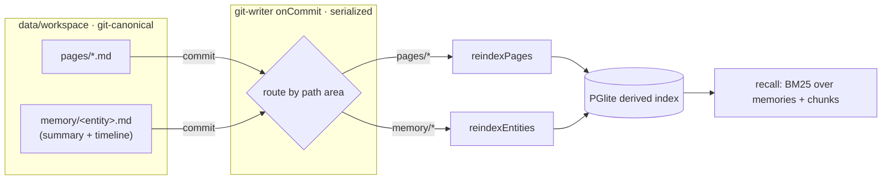
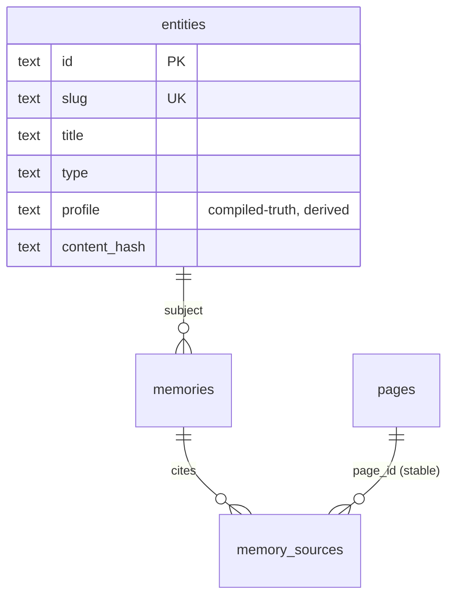

# feat: Phase 2 — memory on the files+git substrate

## Summary

Make the memory layer real on the Phase 0+1 substrate, the same way pages already
work: **memories live as user-facing git-canonical files at the entity/subject
grain**, and PGlite is their derived recall index. Each entity (person, team,
project, repo, topic) gets one Markdown file following GBrain's **"compiled-truth
+ timeline"** shape — a summary (the profile) on top, a dated timeline of facts
below. The existing `memories` / `memory_sources` tables become the **derived
index**, atomized from those files and reindexed exactly like `page_chunks`; BM25
recall is unchanged. Entities and profiles graduate from vision to real, minimal-
but-usable primitives (explicit population, no auto-extraction).

This is **Cabinet-style on purpose**: entity files are browsable and editable in
the DATA tree like any page — a shared human+agent workspace, not a hidden agent
store. One storage rule (files canonical, DB derived) now covers pages *and*
memory.

## Problem Frame

Today the memory layer (`packages/memory`) writes `memories` rows directly to
PGlite — but Phase 0+1 made files canonical and the DB a rebuildable index for
pages. Memory is now the odd one out: DB-canonical, invisible in the workspace,
and with only coarse data-modeled lineage (`status`/`superseded_by`). Entities
and profiles are vision-only (no tables, no store). And there's no test proving a
memory's page citation survives a page rename (it should, since `pages.id` is
frontmatter-stable, but it's unverified).

The locked direction (see Open Questions for the reasoning trail): memory becomes
file-canonical at the **entity grain** — not per-fact (git chokes past ~5k files;
GBrain hit exactly this) and not DB-canonical (loses the git lineage that makes a
company brain's provenance valuable). The entity file is the unit; the DB
atomizes its facts for retrieval.

## Requirements

- **R1** — Memories are stored in git-canonical Markdown files at the entity/subject
  grain (compiled-truth + timeline); the DB is a rebuildable derived index.
- **R2** — Entity files are first-class workspace files: browsable and editable in
  the DATA tree, reindexed through the same single-writer/commit-hook path as pages.
- **R3** — The existing `memories`/`memory_sources` rows are derived (atomized from
  entity files); BM25 recall (`bm25_local_v1`) is preserved unchanged.
- **R4** — `entities` and `profiles` are real, minimal-but-usable: entity = the
  canonical file; profile = its compiled-truth section (derived); population is
  explicit (API/MCP/CLI/agent), not auto-extracted.
- **R5** — The memory store's public API (`saveMemory`, `forgetMemory`,
  `getMemory`, `listMemories`, `recall`, `ingestArtifact`) stays stable so server,
  MCP, and CLI surfaces need no rewrite; writes become file-first.
- **R6** — A memory's page citation survives a page rename — verified by a test.
- **R7** — A full `reindex` rebuilds the entire memory index (entities, atomized
  memories, citations, profiles) from the entity files alone.

## Key Technical Decisions

- **KTD1 — Entity grain, not per-fact, not DB-canonical.** One file per entity/
  subject (GBrain compiled-truth+timeline). File count scales with *entities*
  (hundreds–thousands), staying under git's ~5k-file ceiling, while atomic facts
  (which explode) are rows in the derived index. *(resolves origin OQ1)*
- **KTD2 — Memory lives in a new workspace area `memory/`.** Entity files at
  `memory/<entity-slug>.md`. User-facing and in the DATA tree (Cabinet-style). The
  workspace package's hardcoded `pages/` constant generalizes to area-aware path
  helpers (U1).
- **KTD3 — `memories`/`memory_sources` become derived.** `reindexEntities` mirrors
  `reindexPages`: parse the entity file, upsert the `entities` row, delete+reinsert
  the entity's atomized `memories`, parse fact citations into `memory_sources`. Runs
  inside the git-writer `onCommit` hook, routed by path area.
- **KTD4 — Profile = the compiled-truth section, derived.** Stored on the `entities`
  row (or a `profiles` view), regenerated on reindex from the file's summary
  section. Not a separate hand-authored artifact.
- **KTD5 — Facts carry a stable id.** Each timeline fact gets a stable id (embedded
  marker, assigned on write) so atomized `memories` rows and their citations/
  supersession survive edits and reindex — mirroring the page frontmatter `id`.
- **KTD6 — Memory writes are file-first.** `saveMemory` resolves/creates the
  subject's entity file, appends a timeline fact, commits (the hook reindexes →
  `memories` row). Reads (`recall`/`get`/`list`) read the derived DB index unchanged.
- **KTD7 — `source_artifacts` stay as-is for Phase 2** (raw imported provenance,
  DB-backed; filing them as workspace files is deferred — see Scope Boundaries).

## High-Level Technical Design

### Storage model: one rule for pages and memory



### Entity file shape (directional — exact format finalized in U2)

```markdown
---
id: 9f1c…            # stable entity id
title: Ada Lovelace
type: person          # person | team | project | company | repo | topic
tags: [eng]
---

## Summary
<!-- the profile: compiled current understanding, human- and agent-editable -->
Lead on the storage refactor; prefers async-first comms.

## Timeline
- 2026-06-17 — **decision** [#a1b2] — Chose isomorphic-git over simple-git. [[refactor-markdown-first-spec]] (confidence: 0.9)
- 2026-06-15 — **preference** [#c3d4] — Prefers files-canonical storage. (confidence: 1)
```

Reindex atomizes each timeline item into a `memories` row (`kind`, `content`,
`subject` = entity, `confidence`, stable id from the `[#…]` marker), resolves
`[[wiki-links]]` into `memory_sources` citations, and writes the Summary into the
entity's profile.

### Derived schema additions (migration 12)



`memories` gains `entity_id` (FK → `entities.id`) and the row id becomes the
fact's stable id. `memory_sources.page_id → pages(id)` is unchanged (already
rename-stable).

---

## Output Structure

New workspace area + one new module; most work extends existing files.

```
data/workspace/
  memory/<entity-slug>.md        # NEW canonical entity files (runtime, gitignored repo)
packages/memory/src/
  index.ts                       # extend: file-first store + reindexEntities
  entity-file.ts                 # NEW: parse/serialize compiled-truth+timeline
  entity-file.test.ts            # NEW
```

---

## Scope Boundaries

### In scope
Entity-file storage model, `memory/` workspace area, `reindexEntities` + hook
routing, file-first `saveMemory`/`forgetMemory`, `entities`+`profiles` as derived
primitives with minimal surfaces (list entities, get profile), citation-rename
regression test, full-rebuild-from-files.

### Deferred to Follow-Up Work
- **Auto-extraction** of entities/facts from conversations/pages (its own phase).
- **Filing `source_artifacts` as workspace files** — they stay DB-backed/ingested for now (KTD7).
- **Vector/hybrid retrieval** (pgvector + RRF) — BM25 stays; vectors are a later track.
- **Rich profile generation** (LLM-summarized profiles) — profile = the human/agent-edited Summary section for now.

### Out of scope (non-goals)
- Changing the BM25 recall algorithm.
- Per-page optimistic concurrency / multi-user (Phase 5).

---

## Implementation Units

### U1. Area-aware workspace path helpers
- **Goal:** Generalize the workspace package beyond the hardcoded `pages/` subtree so a `memory/` area can reuse the same read/write/list/slug machinery.
- **Requirements:** R2.
- **Dependencies:** none.
- **Files:** `packages/workspace/src/index.ts`, `packages/workspace/src/index.test.ts`.
- **Approach:** Replace the `PAGES_DIR = "pages"` constant usage in `pageFilePath`/`dirIndexPath`/`slugFromPath`/`listPageSlugs` with an area parameter (default `"pages"` to keep the existing API behavior). Add an analogous set for the `"memory"` area, or make all four helpers accept `area`. Keep `readPage`/`writePage`/`deletePage`/`parsePage`/sanitize area-agnostic (they already are). `slugFromPath` must strip the correct area prefix.
- **Patterns to follow:** existing `pageFilePath`/`slugFromPath`/`listPageSlugs` in `packages/workspace/src/index.ts`.
- **Test scenarios:**
  - Happy: `filePath("memory", "ada")` → `memory/ada.md`; `slugFromPath("memory/ada.md")` → `ada`.
  - Happy: existing `pages` helpers unchanged (default area) — existing workspace tests still pass.
  - Edge: nested slug (`memory/team/eng`) round-trips through path↔slug.
  - Edge: `listSlugs("memory")` walks only the memory subtree, not `pages/`.
- **Verification:** workspace suite green; `pages` behavior identical; a `memory` area resolves paths correctly.

### U2. Entity-file format: parse/serialize (compiled-truth + timeline)
- **Goal:** A module that converts an entity Markdown file ↔ a structured `{ entity meta, profile, facts[] }`, and appends/updates timeline facts with stable ids.
- **Requirements:** R1, KTD1, KTD5.
- **Dependencies:** U1.
- **Files:** `packages/memory/src/entity-file.ts`, `packages/memory/src/entity-file.test.ts`.
- **Approach:** Parse frontmatter (id, title, type, tags) via the workspace `parsePage` primitives; parse the `## Summary` block into `profile`; parse `## Timeline` list items into facts `{ id, date, kind, content, citations[], confidence }` using a defined line grammar (the `[#id]` marker is the stable fact id; `[[slug]]` are citations). Provide `appendFact(file, fact)` that assigns a new stable id and writes the item, and `setFactStatus(file, factId, status)` for forget/supersede. Round-trip must be stable.
- **Technical design (directional, not spec):** fact line ≈ `- <ISO date> — **<kind>** [#<id>] — <content> [[<cite-slug>]]… (confidence: <n>)`. Finalize the exact grammar here; keep it human-writable.
- **Patterns to follow:** `gray-matter` usage and `previousSlugs`/frontmatter handling in `packages/workspace/src/index.ts`; `chunkText`/parse helpers in `packages/memory/src/index.ts`.
- **Test scenarios:**
  - Happy: serialize→parse round-trips entity meta, profile, and N facts with kinds/confidence/citations intact.
  - Happy: `appendFact` assigns a unique stable id and preserves existing facts.
  - Edge: a file with no `## Timeline` yet (new entity) parses to zero facts; a fact with no citation/confidence parses with defaults.
  - Edge: malformed timeline line is skipped (or surfaced) without corrupting the rest.
  - Edge: a hand-edited fact lacking a `[#id]` marker gets one assigned on next write (stable thereafter).
- **Verification:** round-trip stable; stable fact ids survive edits; hand-authored files parse.

### U3. Migration 12: entities table + memory→entity link + profile
- **Goal:** Schema for the derived entity/profile index.
- **Requirements:** R3, R4, KTD3, KTD4.
- **Dependencies:** none (can land alongside U1/U2).
- **Files:** `packages/db/src/index.ts`, `packages/memory/src/index.test.ts` (schema-touching memory tests).
- **Approach:** Add migration **12**: create `entities (id text pk, slug text unique, title, type, profile text, tags_json text, content_hash text, created_at, updated_at, deleted_at)`; `alter table memories add column entity_id text references entities(id)`; index `memories(entity_id)`. Profile stored on `entities.profile` (derived). No data backfill (greenfield).
- **Patterns to follow:** `applyMigration` calls and table/index style in `packages/db/src/index.ts` (migrations 1–11); `content_hash` precedent from migration 11.
- **Test scenarios:**
  - Happy: fresh DB applies migration 12; `entities` and `memories.entity_id` exist with indexes.
  - Edge: re-running migrations is idempotent (version recorded in `schema_migrations`).
  - Integration: `memory_sources.page_id` FK and existing memory columns are unaffected.
- **Verification:** migration applies cleanly on a fresh PGlite temp dir; existing memory tests pass.

### U4. reindexEntities — atomize entity files into the derived index
- **Goal:** The single index writer for memory, mirroring `reindexPages`: rebuild `entities`, atomized `memories`, `memory_sources`, and profiles from entity files; wire it into the commit hook routed by path area.
- **Requirements:** R3, R7, KTD3.
- **Dependencies:** U1, U2, U3.
- **Files:** `packages/memory/src/index.ts` (add `reindexEntities`/`reindexAllEntities`), `packages/pages/src/index.ts` or `apps/server/src/index.ts` (hook routing), `packages/memory/src/index.test.ts`.
- **Approach:** `reindexEntities(db, workspace, slugs)`: for each entity slug, read the file; missing → tombstone the `entities` row + its `memories`. Else compute `content_hash` over frontmatter+body (skip if unchanged), upsert the `entities` row (profile = Summary), then `delete from memories where entity_id = $1` and re-insert one row per parsed fact (id = fact stable id, `kind`, `content`, `subject` = entity title, `confidence`, `status`), and rewrite `memory_sources` from each fact's `[[slug]]` citations (resolve slug→`pages.id`). `reindexAllEntities` walks the `memory/` area and tombstones orphans. Generalize the `onCommit` hook so `memory/*` paths route to `reindexEntities` and `pages/*` to `reindexPages` (use `slugFromPath` per area).
- **Patterns to follow:** `reindexPages`/`reindexAllPages` and the `gitWriter.setOnCommit` wiring in `packages/pages/src/index.ts`; `writeMemorySources` in `packages/memory/src/index.ts`.
- **Test scenarios:**
  - Happy: an entity file with 3 timeline facts produces 1 `entities` row + 3 `memories` rows + their citations; profile = Summary text.
  - Integration: delete the DB rows, `reindexAllEntities`, and the index is identical (rebuildable invariant, R7).
  - Edge: incremental — unchanged file is skipped by `content_hash`; editing one fact updates only that entity's rows.
  - Edge: removing the file tombstones the entity and its memories.
  - Edge: a `[[slug]]` citation resolves to the right `pages.id`; an unresolved slug is recorded without a `page_id`.
- **Verification:** rebuild-from-files reproduces recall results; commit-hook routing reindexes the correct area.

### U5. File-first memory store (saveMemory/forgetMemory)
- **Goal:** Memory writes go through the workspace + git writer; reads stay on the derived index. Public API unchanged.
- **Requirements:** R1, R5, KTD6.
- **Dependencies:** U2, U4.
- **Files:** `packages/memory/src/index.ts`, `apps/server/src/index.ts` (pass `gitWriter` + `workspace` into `createMemoryStore`), `packages/memory/src/index.test.ts`.
- **Approach:** `createMemoryStore(db, { gitWriter, workspace })` (mirror `createPageStore`); `fileMode` when both present. In file mode, `saveMemory({ kind, content, subject, sources })` resolves the entity file for `subject` (create it if absent, slugified), `appendFact`, and commits via `gitWriter.enqueue` (the hook reindexes → `memories` row); returns the resulting `MemoryWithSources` read back from the index. `forgetMemory(id)` finds the fact's entity file, marks the fact forgotten, commits → reindex. `getMemory`/`listMemories`/`recall` are unchanged (read the DB index). Legacy DB-direct mode (no gitWriter) retained so existing memory tests pass.
- **Patterns to follow:** `persistPageFileMode`/`writePageFile` and legacy-vs-file-mode branching in `packages/pages/src/index.ts`.
- **Test scenarios:**
  - Happy (file mode): `saveMemory` writes/creates the subject's `memory/<slug>.md`, commits once, and the memory is recallable after the hook reindex.
  - Happy: two `saveMemory` calls for the same subject append two facts to one file (not two files).
  - Edge: `forgetMemory` marks the fact forgotten in the file and drops it from active recall; the timeline entry (history) remains in git.
  - Integration: `recall` returns the saved memory with a citation resolving to the cited page.
  - Edge: legacy mode (no gitWriter) still writes the DB row directly — existing memory suite passes unchanged.
- **Verification:** file-mode save produces one entity file + one attributed commit; recall reflects it; existing tests green.

### U6. Entities + profiles surfaces (API / MCP / CLI), minimal-but-usable
- **Goal:** Let humans and agents list entities and fetch a profile through the same backend→API→CLI/MCP parity the project requires.
- **Requirements:** R4.
- **Dependencies:** U3, U4.
- **Files:** `apps/server/src/index.ts`, `apps/mcp/src/index.ts`, `apps/cli/src/index.ts`, plus a small `listEntities`/`getProfile` in `packages/memory/src/index.ts` (+ tests in the relevant suites).
- **Approach:** Add `memory.listEntities({ type? })` and `memory.getProfile(slug)` (returns the entity row incl. profile + its active memories). Expose `GET /api/entities`, `GET /api/entities/:slug` (server); `company_brain_list_entities` + `company_brain_get_profile` (MCP, read-only); `cb memory entities` + `cb memory profile <slug>` (CLI, dual-path). No auto-extraction — population is via existing `saveMemory` (which now creates entities).
- **Patterns to follow:** existing recall/memory routes in `apps/server/src/index.ts`, MCP tool registration in `apps/mcp/src/index.ts`, `handleMemoryCommand` in `apps/cli/src/index.ts`.
- **Test scenarios:**
  - Happy: after saving memories for two subjects, `listEntities` returns both; `getProfile(slug)` returns the profile + active memories.
  - Edge: `getProfile` of an unknown slug → not-found (404 at API).
  - Integration: an entity created via `saveMemory` appears through the API/MCP/CLI surfaces (parity).
- **Verification:** the three surfaces return entities/profiles consistently; parity holds (UI-action ≡ backend ≡ CLI/MCP).

### U7. Citation-survives-rename regression test
- **Goal:** Prove a memory's page citation still resolves after the cited page is renamed (the gap research flagged).
- **Requirements:** R6.
- **Dependencies:** U5 (or can run against the existing page store + a manually-inserted memory_source).
- **Files:** `packages/memory/src/index.test.ts` (or a cross-package test under `packages/pages`).
- **Approach:** In file mode: create a page, `saveMemory` citing it (`source-page` → `page_id`), rename the page (title change → slug change), reindex, and assert the memory's `memory_sources.page_id` still equals the page's stable id and recall still surfaces the citation with the new slug label.
- **Patterns to follow:** the U5 page-rename test in `packages/pages/src/index.test.ts`; `withMemoryStore`/`withFilePageStore` harnesses.
- **Test scenarios:**
  - Happy: memory cites page A; rename A→A'; `memory_sources.page_id` unchanged; recall citation label reflects the new slug.
  - Edge: page soft-deleted → `page_id` set null (per FK `on delete set null`); recall no longer resolves a page citation but the memory remains.
- **Verification:** the citation-stability test passes, closing the unverified gap.

### U8. Entity files in the DATA tree (Cabinet-style, user-facing)
- **Goal:** Entity/memory files are browsable and editable in the workspace UI like pages — the agent-native-OS requirement.
- **Requirements:** R2.
- **Dependencies:** U1, U4.
- **Files:** `apps/server/src/index.ts` (list/get for the `memory/` area), `apps/web/src/App.tsx` (DATA tree shows the memory area; entity files open in the editor).
- **Approach:** Surface the `memory/` area in the file listing the DATA tree consumes (either fold into the existing page-tree listing as a top-level area, or add an `area` to the list endpoint). Opening an entity file uses the existing Markdown/editor path (it's a workspace file). Editing + saving goes through the single writer → reindex (so a human edit to the Summary updates the profile).
- **Patterns to follow:** the DATA tree + page fetch/edit flow in `apps/web/src/App.tsx`; the page list/get routes in `apps/server/src/index.ts`.
- **Test scenarios:**
  - Happy: an entity file created via `saveMemory` appears in the DATA tree listing under the memory area.
  - Integration: editing an entity file's Summary in the editor and saving commits + reindexes, updating the profile (human edit ≡ agent edit path).
  - Edge: the memory area renders distinctly from pages but uses the same editor.
- **Verification:** entity files are visible and editable in the UI; a human edit flows through the same commit→reindex path as an agent write.

---

## Risk Analysis & Mitigation

- **Atomization grammar drift** — if the timeline fact grammar is too loose, parsing is fragile; too strict, humans can't write it. *Mitigation:* lock a small, forgiving grammar in U2 with round-trip tests; assign missing fact ids on next write; skip (don't crash on) malformed lines.
- **Fact-id stability across edits** — losing a fact's id on edit would orphan its citations/supersession. *Mitigation:* the `[#id]` marker is the durable key (KTD5), tested in U2; reindex keys `memories` rows on it.
- **Hook routing regressions** — generalizing the `onCommit` hook could mis-route `pages/*` vs `memory/*`. *Mitigation:* route by area via `slugFromPath`; keep `reindexPages` behavior identical; test both areas reindex independently.
- **Scale** — entity-grain keeps file count low, but a very large brain still grows the `memory/` tree. *Mitigation:* documented ~5k-file revisit trigger (sharding/DB fast-path) carried from the storage learning; not a Phase 2 concern.
- **Source-artifact inconsistency** — artifacts stay DB-backed while memories go file-canonical. *Mitigation:* explicit scope boundary (KTD7); revisit when filing artifacts.

---

## Open Questions

- **OQ1 (resolved):** memory storage model. **Locked:** git/file-canonical at the
  **entity grain** (GBrain compiled-truth+timeline), DB derived. Rejected:
  one-file-per-fact (git chokes past ~5k files — GBrain reports a 7.5k-file wiki
  "choking git"); DB-canonical atomic (loses git provenance, two storage models).
  Grounding: [What Is GBrain?](https://vectorize.io/articles/what-is-gbrain).
- **OQ2 (execution-time):** exact `memory/` area name and whether nested entity
  slugs (e.g. `team/eng`) are needed — finalize in U1/U2.
- **OQ3 (execution-time):** exact timeline fact grammar and stable-id marker syntax
  — finalize in U2 against round-trip tests.

---

## Sources & Research

- Origin: `docs/refactor-markdown-first-spec.md` (§ Phases 2–5), `docs/plans/2026-06-17-001-refactor-markdown-first-files-git-plan.md`.
- Learning: `docs/solutions/architecture-patterns/files-git-canonical-storage-with-single-writer.md` (the rules this phase extends to memory).
- Prior art (load-bearing): GBrain's "compiled-truth + timeline" page model and the ~5k-file git ceiling — [vectorize.io/articles/what-is-gbrain](https://vectorize.io/articles/what-is-gbrain), [lucaberton.com GBrain](https://lucaberton.com/blog/garry-tan-gbrain-ai-agent-knowledge-graph-2026/). GBrain is OpenClaw's brain, so this is the directly relevant prior art for entity-grained memory.
- Repo research (this session): current `createMemoryStore` API + recall internals (`packages/memory/src/index.ts`), schema + next migration = 12 (`packages/db/src/index.ts`), `reindexPages`/onCommit hook to mirror (`packages/pages/src/index.ts`), area-hardcoded `PAGES_DIR` to generalize (`packages/workspace/src/index.ts`), and confirmation that `memory_sources.page_id → pages(id)` with frontmatter-stable `pages.id` (citation already survives renames; untested — U7 closes it).
