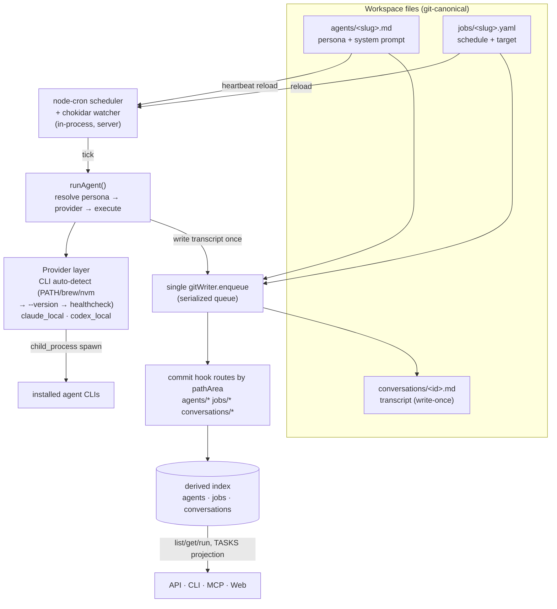

# feat: Agent runtime + scheduled jobs (Phase 3)

Phase 3 of the markdown-first refactor. Makes Company Brain's **agents** real on the
same files-canonical + derived-index substrate built in Phases 0–2: personas are
workspace files, scheduled jobs run them, a provider layer executes the work by
detecting and driving locally-installed agent CLIs, and each run is captured as a
git-canonical conversation transcript that can feed memory.

---

## Problem Frame

Today the brain is a passive store: humans and agents read/write pages and memory,
but nothing *runs*. The Cabinet-inspired vision is an agent-native OS — a left-nav
DATA / TEAM / TASKS workspace where named agents do scheduled work and their runs
are inspectable. Phases 0–2 delivered the storage spine (files+git canonical, PGlite
derived index, single git writer with per-area commit-hook routing, pages +
memory/entities/profiles as workspace files, UI=API=CLI=MCP parity). Phase 3 adds
the **runtime**: agents, jobs, providers, and transcripts — without breaking the
one-container default, the single git writer, or the derived-index model.

The hard part is not the feature list; it is porting Cabinet's runtime onto a
substrate with a *different invariant*. Cabinet free-commits because it is implicitly
single-writer; Company Brain enforces a serialized writer for multi-user safety
(see `docs/cabinet-deep-dive.md` §7, and the learning at
`docs/solutions/architecture-patterns/files-git-canonical-storage-with-single-writer.md`).
Every agent action, job-triggered write, and conversation finalize must flow through
the existing `gitWriter.enqueue` queue with reindex **inside** the commit hook — not
copy Cabinet's direct-write paths.

---

## Requirements

Traced to `docs/refactor-markdown-first-spec.md` §2.2–2.4, §5, §7 and
`docs/cabinet-deep-dive.md` §4.

- **R1 — Agents as files.** An agent is a workspace file (`agents/<slug>.md`):
  frontmatter (identity, provider/model, schedule, enabled) + body = system prompt.
  Reindexed into a derived `agents` table like pages/entities.
- **R2 — Jobs as files.** A job is a `jobs/<slug>.yaml` definition (schedule, target
  agent, prompt, provider override, timeout, lifecycle hooks). Reindexed into `jobs`.
- **R3 — Provider layer with CLI auto-detection.** A pluggable provider interface;
  the primary provider detects locally-installed agent CLIs (claude, codex) via a
  three-tier probe (PATH/brew/nvm resolve → `--version` → healthcheck) and drives them
  via `child_process`. Detection results are queryable.
- **R4 — Run an agent.** `runAgent` resolves an agent's persona + provider, executes a
  prompt to completion, and writes the result as a conversation transcript.
- **R5 — Conversation transcripts (files-canonical, write-once).** Each run produces
  one immutable `conversations/<id>.md` (frontmatter: agent, job, status, timing,
  provider, usage, error; body: the turns), committed once at completion and reindexed
  into `conversations`.
- **R6 — In-process scheduler.** An in-process node-cron scheduler runs enabled jobs
  (and agent heartbeats) on their cron schedules; a chokidar watcher reloads schedules
  when agent/job files change. No separate daemon (preserve one-container default).
- **R7 — Parity.** Every new capability is reachable from API, CLI, and MCP, and the
  read/run surfaces appear in the web UI (TEAM agents, TASKS conversations). `cb reindex`
  and `POST /api/admin/reindex` rebuild **all** areas.
- **R8 — Single-writer + recoverable index.** All writes (agent-authored, job-triggered,
  transcript finalize) go through the one shared `gitWriter`; reindex runs inside the
  commit hook; a hook failure never rolls back a durable commit; the DB stays rebuildable
  from files.

---

## Key Technical Decisions

- **KTD1 — Bare area names (`agents/`, `jobs/`, `conversations/`).** The spec sketched
  dot-prefixed `.agents/`/`.jobs/`; the code convention is bare top-level areas
  (`pages/`, `memory/`) keyed by `pathArea` (first path segment). Standardize on **bare**
  for consistency with the existing reindex/hook machinery. The DATA page-tree only
  renders the `pages` table, so bare areas don't leak into it.
- **KTD2 — One file per conversation, not a run directory.** Cabinet uses a per-run dir
  (`meta.json`, `prompt.md`, `transcript.txt`, `turns/NNN-*.md`, …) — 6+ files per run.
  Phase 2 documented a ~5k-file git ceiling (`docs/plans/2026-06-17-002-…-plan.md` KTD1).
  Agents/jobs are low-count, but conversations grow fastest, so collapse each run to a
  **single** `conversations/<id>.md` (frontmatter metadata + body turns) written once at
  completion. Carry the ~5k-file revisit trigger (shard by date / DB fast-path) forward.
- **KTD3 — Local-CLI provider is primary, behind a pluggable interface.** Per the locked
  decision, the default/primary provider auto-detects and drives installed agent CLIs
  (Cabinet-style). The `Provider` interface is the seam so an API-key provider can be
  added later without touching the runtime. Host code execution is an accepted risk for
  this self-hosted, operator-controlled agent OS (see Risks).
- **KTD4 — Transcripts written once at completion.** Scheduled runs run to completion, so
  in-progress turns buffer in memory and only the **final** transcript is committed
  (one commit per run). No per-turn commits. Live UI streaming (if added later) reads the
  in-memory buffer; the committed artifact is the finished transcript.
- **KTD5 — Tasks are a projection, not a store.** The TASKS view is derived from
  conversation `status` (Inbox / Running / Awaiting input / Done / Archived) via
  lane rules — no separate task table or files (spec §2.4, deep-dive §4.4).
- **KTD6 — Non-markdown files need raw workspace helpers.** Jobs are YAML; the existing
  `writeFileIn`/`listSlugsIn` assume markdown + frontmatter + `.md`. Add raw
  `readRawIn`/`writeRawIn`/`listRawIn(area, ext)` that still route through
  `areaFilePath`/`assertSafeSlug` and the single writer. This is the largest
  workspace-layer change.
- **KTD7 — One shared `gitWriter`/`workspace`/`db`.** The agents store must be constructed
  from the *same* instances the server builds (never a second `createGitWriter` on the
  same dir — it would bypass the serialized queue and race the lock). Same rule the CLI
  write-guard already enforces.
- **KTD8 — No per-resource optimistic concurrency.** `baseVersion` is repo-global; naive
  per-agent/job tokens fire false conflicts across unrelated edits. Leave unwired
  (documented deferral from Phase 0–2).

---

## High-Level Technical Design



The runtime reuses Phase 0–2 infrastructure unchanged: `enqueue` (serialized writer),
`addCommitHook` (per-area routing), the reindex shape (parse → content_hash skip →
upsert → rebuild children → tombstone-missing), and the parity pattern across surfaces.

---

## Output Structure

```text
packages/
  agents/                         # new package
    package.json                  # deps: db, git-writer, workspace (+ node-cron, chokidar, yaml)
    tsconfig.json
    src/
      index.ts                    # stores + reindex + runAgent + scheduler factory
      agent-file.ts               # persona parse/build (frontmatter + system-prompt body)
      job-file.ts                 # YAML job parse/validate (zod)
      conversation-file.ts        # transcript build/parse (write-once)
      provider.ts                 # Provider interface + registry + CLI auto-detection
      providers/
        local-cli.ts              # claude_local / codex_local child_process adapter
      scheduler.ts                # node-cron + chokidar watcher
      *.test.ts
workspace files (in the data/ git repo, gitignored from project):
  agents/<slug>.md
  jobs/<slug>.yaml
  conversations/<id>.md
```

Per-unit `**Files:**` lists remain authoritative; the tree is the intended shape.

---

## Implementation Units

Grouped into five phases. The **vertical-slice MVP** (one persona on a schedule runs
via a detected CLI and writes a transcript) is reached at U10; U11–U14 complete parity.

### Phase A — Substrate (areas, formats, schema)

### U1. Workspace: raw helpers + agents/jobs/conversations areas

**Goal:** Add the three new areas and raw (non-markdown) read/write so YAML jobs and
transcript files are first-class while reusing the path-safety + git-staging contract.

**Requirements:** R1, R2, R5, R8. **Dependencies:** none.

**Files:** `packages/workspace/src/index.ts`, `packages/workspace/src/index.test.ts`.

**Approach:** Add `AGENTS_DIR="agents"`, `JOBS_DIR="jobs"`, `CONVERSATIONS_DIR="conversations"`.
Add markdown wrappers (`readAgent`/`writeAgent`/`deleteAgent`/`listAgentSlugs`,
and the same for conversations) bound to the generic `*In` functions, exactly like the
entity wrappers. Add **raw** helpers `readRawIn(area, relPath)` / `writeRawIn(area, relPath, content, now)` /
`listRawIn(area, ext)` for `jobs/*.yaml` — raw helpers skip `matter.stringify`/frontmatter
stamping and accept an extension filter, but still call `assertSafeSlug` and build paths via
`areaFilePath`. Export `readJob`/`writeJob`/`listJobSlugs` wrappers over the raw helpers.
Keep all existing page/entity wrappers byte-identical (zero Phase 1–2 regression risk).

**Patterns to follow:** the entity wrapper closures and `assertSafeSlug` chokepoint in
`packages/workspace/src/index.ts`.

**Test scenarios:**
- writeAgent/readAgent round-trip (markdown + frontmatter) under `agents/`.
- writeJob/readJob round-trip preserves raw YAML bytes (no frontmatter stamping).
- listJobSlugs returns only `.yaml`; listAgentSlugs only `.md`; areas don't cross-contaminate.
- `pathArea("agents/x.md")==="agents"`, `pathArea("jobs/y.yaml")==="jobs"`, `slugFromPath` strips area + ext for each.
- a traversal slug (`../escape`) is rejected by every new wrapper (raw and markdown).

**Verification:** new wrappers exist and round-trip; existing workspace tests still pass.

### U2. Agent persona file format

**Goal:** Parse/serialize an agent file: frontmatter identity + body = system prompt.

**Requirements:** R1. **Dependencies:** U1.

**Files:** `packages/agents/src/agent-file.ts`, `packages/agents/src/agent-file.test.ts`
(new `@company-brain/agents` package scaffolded here — see U-shared note below).

**Approach:** `AgentDoc { id, slug, name, provider?, model?, effort?, enabled, schedule?(cron for heartbeat), tags[], systemPrompt }`. `parseAgent(stored)` reads
frontmatter (id/name/provider/model/effort/enabled/schedule/tags) and treats the markdown
body as the system prompt. `buildAgentFile(doc)` → `{frontmatter, markdown}`. Mirror
`entity-file.ts` structure (stable `id`, defaults). Body is templatable later but stored verbatim now.

**Patterns to follow:** `packages/memory/src/entity-file.ts` (parse/build/defaults).

**Test scenarios:**
- round-trip an agent doc (identity + multi-paragraph system prompt) through build→parse.
- defaults applied when frontmatter omits provider/model/enabled (enabled defaults true).
- a hand-authored agent file with only `name` + body parses (id backfilled, deterministic).
- `enabled: false` round-trips as false (no falsy coercion).

**Verification:** parse/build stable across a second round-trip.

> **U-shared note:** U2 creates the `@company-brain/agents` package skeleton
> (`package.json`, `tsconfig.json`, empty `src/index.ts`) since it is the first unit to
> add files there. Add deps `@company-brain/{db,git-writer,workspace}` (`workspace:*`),
> `node-cron`, `chokidar`, `yaml`, devDeps `tsx`/`typescript`; register the package in
> root `pnpm test` and run `pnpm install`.

### U3. Job YAML file format

**Goal:** Parse + validate a job definition from YAML.

**Requirements:** R2. **Dependencies:** U1, U2.

**Files:** `packages/agents/src/job-file.ts`, `packages/agents/src/job-file.test.ts`.

**Approach:** `JobDoc { id, slug, name, enabled, schedule (cron string), provider?, model?,
agent (target slug), prompt, timeoutMs?, oneShot?, onComplete?[], onFailure? }`. Parse YAML
with the `yaml` dep; validate with a zod schema; reject invalid cron / missing target agent.
`parseJob(raw)` → `JobDoc`; `serializeJob(doc)` → YAML string. Validate cron with
`node-cron`'s `validate()`.

**Patterns to follow:** zod schemas in `apps/server/src/index.ts`; `node-cron.validate`.

**Test scenarios:**
- a valid job YAML parses to a typed JobDoc with all fields.
- invalid cron string → validation error naming the field.
- missing `agent` or `prompt` → validation error.
- `enabled`/`oneShot` default correctly; round-trip serialize→parse is stable.
- unknown extra keys are ignored (forward-compat) without throwing.

**Verification:** valid jobs parse; malformed jobs raise clear errors.

### U4. Conversation transcript file format

**Goal:** Build/parse a write-once transcript file.

**Requirements:** R5. **Dependencies:** U1.

**Files:** `packages/agents/src/conversation-file.ts`, `packages/agents/src/conversation-file.test.ts`.

**Approach:** `ConversationDoc { id, agent (slug), job?(slug), status, provider, model?,
startedAt, endedAt?, usage?, error?, turns: {role, content}[] }`. `buildConversationFile(doc)`
→ frontmatter (all metadata) + body (turns rendered as `## <role>` sections, fenced result
block at end). `parseConversation(stored)` reverses it. Status enum:
`running|awaiting_input|done|failed|archived`. Files are immutable post-finalize (no edit path).

**Patterns to follow:** `entity-file.ts` section parsing; Cabinet `finalizeConversation`
fenced-result-block convention (`docs/cabinet-deep-dive.md` §4).

**Test scenarios:**
- build→parse round-trips status, timing, usage, error, and ordered turns.
- a `failed` conversation with an `error` and no result block parses.
- multi-turn body with fenced code inside a turn does not break section parsing.
- `awaiting_input` status round-trips (drives the TASKS "Your turn" lane).

**Verification:** transcript round-trips; status/usage/turns preserved.

### U5. Migration 13 — agents / jobs / conversations derived tables

**Goal:** Derived index tables for the three areas.

**Requirements:** R1, R2, R5. **Dependencies:** none (can land in parallel with U1–U4).

**Files:** `packages/db/src/index.ts`, `apps/cli/src/index.ts` (extend `migrationTables`),
`packages/agents/src/index.test.ts` (migration smoke test).

**Approach:** `applyMigration(db, 13, …)`: `agents (id, slug, name, provider, model, enabled,
schedule, tags_json, content_hash, created_at, updated_at, deleted_at)`; `jobs (id, slug,
name, enabled, schedule, agent_slug, provider, content_hash, …, deleted_at)`; `conversations
(id, agent_slug, job_slug, status, provider, model, started_at, ended_at, usage_json, error,
content_hash, created_at, deleted_at)`. Live-only unique slug index per table
(`… where deleted_at is null`), plus status/agent_slug indexes on conversations. Extend the
CLI `migrationTables` array so `migrate to postgres` copies the new tables.

**Patterns to follow:** migration 12 (entities) conventions in `packages/db/src/index.ts`.

**Test scenarios:**
- after migrate, insert+read an agent, a job, and a conversation row.
- live-only unique slug index allows a tombstoned + a live row with the same slug.
- conversations status/agent_slug indexes exist (query plan or insert/select smoke).

**Verification:** migration applies idempotently; tables usable; `migrationTables` updated.

### Phase B — Index + agent store

### U6. Reindex + commit-hook routing for the three areas

**Goal:** Make the DB a derived index of the agent/job/conversation files via the shared hook.

**Requirements:** R1, R2, R5, R8. **Dependencies:** U1–U5.

**Files:** `packages/agents/src/index.ts`, `packages/agents/src/index.test.ts`,
`apps/server/src/index.ts` (extend `/api/admin/reindex`).

**Approach:** `reindexAgents/reindexJobs/reindexConversations` + `reindexAll*` mirroring
`reindexEntities` (parse → content_hash over frontmatter+body → skip-if-unchanged → upsert →
tombstone-missing). Conversations reindex is insert/upsert-only (immutable) but still
tombstones a removed file. Register one `addCommitHook` that routes by `pathArea` to the
right reindex (dedup slugs per area). content_hash written **last** for any area with child
rows (none here beyond the row itself, but keep the ordering discipline). Extend
`POST /api/admin/reindex` and add a `cb reindex` (U12) to rebuild pages + memory + all three
new areas (close the existing pages-only gap).

**Patterns to follow:** `reindexEntities`/`reindexAllEntities` + the area-filtered hook in
`packages/memory/src/index.ts`; hash-last recoverability from Phase 2.

**Test scenarios:**
- write an agent file + reindex → agents row present with parsed fields.
- edit the file → content_hash changes → row updates; no-op edit → skipped.
- delete the file → reindexAll tombstones the row.
- a commit touching agents/ + jobs/ in one mutation reindexes both (hook routing).
- reindexAll rebuilds all three areas from files into an empty DB (rebuild-from-files).

**Verification:** files are the source of truth; DB rebuildable; admin reindex covers all areas.

### U7. Agent store + run seam (createConversation)

**Goal:** `createAgentStore(db, {gitWriter, workspace})` exposing list/get/save agents and a
`startConversation` that writes an initial running transcript through the single writer.

**Requirements:** R1, R4, R7, R8. **Dependencies:** U6.

**Files:** `packages/agents/src/index.ts`, `packages/agents/src/index.test.ts`.

**Approach:** `listAgents`, `getAgent(slug)`, `getAgentFile`/`saveAgentFile` (raw markdown edit
through the writer→reindex path, mirroring `saveEntityFile`), `listJobs`/`getJob`,
`listConversations({status?,agent?})`, `getConversation(id)`. `startConversation` /
`finalizeConversation(doc)` build the transcript and `enqueue` a write-once commit (read-modify-write
inside the queue is unnecessary — single immutable write). Register the U6 hook here when
`fileMode`. Actual provider execution is U9–U10; this unit provides the storage seam + a
stub run that records a `done` transcript so the store is testable independently.

**Patterns to follow:** `createMemoryStore` (opts, hook registration, `saveEntityFile`).

**Test scenarios:**
- saveAgentFile edit updates the agent row via reindex (round-trip through writer).
- listAgents/getAgent/listJobs/listConversations return derived rows.
- finalizeConversation writes one `conversations/<id>.md`, commits once, indexes a row.
- listConversations filters by status and by agent.

**Verification:** agent/job/conversation reads + the transcript write seam work end-to-end via the writer.

### Phase C — Provider runtime

### U8. Provider interface + CLI auto-detection

**Goal:** A pluggable `Provider` interface and a detector that finds installed agent CLIs.

**Requirements:** R3. **Dependencies:** U2 (package exists).

**Files:** `packages/agents/src/provider.ts`, `packages/agents/src/provider.test.ts`.

**Approach:** `interface Provider { id; detect(): Promise<DetectionResult>; run(input): Promise<RunResult> }`.
`DetectionResult { available, version?, path?, error? }`. Auto-detection (three-tier, from
deep-dive §4): resolve candidate command names across `PATH` enriched with homebrew + nvm dirs
(`accessSync(X_OK)`) → spawn `--version` with a short timeout → optional per-provider
`healthCheck()`. A `providerRegistry` lists registered providers and their detection status.
Detection is pure-ish (filesystem + spawn) and injectable for tests (pass a fake `which`/spawn).

**Patterns to follow:** Cabinet `provider-cli.ts` three-tier detection (`docs/cabinet-deep-dive.md` §4).

**Test scenarios:**
- detection reports `available:true` + version when a fake CLI resolves and `--version` succeeds.
- `available:false` + error when no candidate resolves on PATH/brew/nvm.
- `--version` timeout → `available:false` with a timeout error (not a hang).
- registry lists all registered providers with their detection results.

**Execution note:** inject the command-resolution + spawn boundary so detection is testable
without real CLIs on the host.

**Verification:** detection correctly classifies present/absent/timeout; registry queryable.

### U9. Local-CLI provider adapter (claude_local / codex_local)

**Goal:** Drive a detected CLI via `child_process` to run a system-prompt + user-prompt to completion.

**Requirements:** R3, R4. **Dependencies:** U8.

**Files:** `packages/agents/src/providers/local-cli.ts`, `packages/agents/src/providers/local-cli.test.ts`.

**Approach:** `run({ systemPrompt, prompt, model?, timeoutMs })` spawns the CLI in headless/exec
mode, feeds the prompt, captures stdout (streamed turns) + exit code, parses usage/result where
the CLI emits structured JSON, and returns `RunResult { status, turns[], usage?, error? }`.
Enforce `timeoutMs` (kill + `failed`). Two registered adapters (`claude_local`, `codex_local`)
sharing a base that differs in command + arg shape + output parsing. No network code — execution
is delegated to the CLI.

**Patterns to follow:** Cabinet `*_local` structured-spawn adapters (`docs/cabinet-deep-dive.md` §4).

**Test scenarios:**
- a fake CLI emitting known stdout → parsed turns + usage + `done`.
- non-zero exit → `failed` with stderr captured in `error`.
- exceeding `timeoutMs` → process killed, `failed` with timeout error.
- model/effort override is passed through to the spawned args.

**Execution note:** inject the spawn boundary (fake child process) — no real CLI in tests.

**Verification:** adapter runs a fake CLI to completion and on the failure/timeout paths.

### U10. Run orchestration — runAgent end-to-end (vertical-slice MVP)

**Goal:** Wire persona → provider → execution → transcript, the full single run.

**Requirements:** R4, R5, R7, R8. **Dependencies:** U7, U9.

**Files:** `packages/agents/src/index.ts`, `packages/agents/src/index.test.ts`.

**Approach:** `runAgent({ agentSlug, prompt, jobSlug?, providerOverride? })`: load the agent
(persona = system prompt, provider/model), resolve the provider from the registry (fall back/
error if unavailable), `startConversation` (running), execute via the provider, then
`finalizeConversation` with status/turns/usage/error — one write-once commit through the shared
writer → reindex. Optional `onComplete` hook seam (e.g. enqueue memory extraction) recorded but
extraction itself deferred. This unit completes the MVP: an agent runs and produces an
inspectable transcript.

**Patterns to follow:** `saveMemory` read-modify-write-in-queue discipline; provider registry from U8.

**Test scenarios:**
- runAgent with a fake provider → a `done` conversation file committed + indexed, turns intact.
- provider unavailable → a `failed` conversation recorded (not a thrown crash) with a clear error.
- provider timeout → `failed` transcript with timeout error.
- the agent's persona body is passed as the system prompt to the provider.
- two concurrent runAgent calls each produce a distinct transcript (serialized writer, no clobber).

**Verification:** a single agent run executes and writes a correct transcript end-to-end.

### Phase D — Scheduler

### U11. In-process node-cron scheduler + chokidar watcher

**Goal:** Run enabled jobs (and agent heartbeats) on schedule; reload on file change.

**Requirements:** R6, R8. **Dependencies:** U10.

**Files:** `packages/agents/src/scheduler.ts`, `packages/agents/src/scheduler.test.ts`,
`apps/server/src/index.ts` (construct + start the scheduler after stores).

**Approach:** `createScheduler({ agentStore, runAgent, workspaceDir })`: load enabled jobs +
agents-with-heartbeat-schedules, register `node-cron` tasks that call `runAgent`; a `chokidar`
watcher on `agents/` + `jobs/` triggers `reloadSchedules()` (cancel + rebuild). `oneShot` jobs
deregister after firing. In-process only (no daemon). Guard against overlapping runs of the same
job (skip if a prior run is still running). Server constructs it from the same store instances
and starts it after wiring; expose start/stop for clean shutdown + tests (inject a fake clock /
manual tick).

**Patterns to follow:** Cabinet node-cron + chokidar `reloadSchedules()` (deep-dive §4); spec §5
"in-process, no separate daemon".

**Test scenarios:**
- a job whose cron fires (manual tick) invokes runAgent with the job's agent + prompt.
- editing a job file triggers reloadSchedules (watcher) and the new schedule takes effect.
- a disabled job does not run; re-enabling via file edit schedules it.
- `oneShot` job runs once then deregisters.
- overlapping fire while a prior run is in-flight is skipped, not stacked.

**Execution note:** inject the cron/clock + watcher boundary so ticks are deterministic in tests.

**Verification:** enabled jobs fire on schedule, reload on edit, and don't overlap.

### Phase E — Surfaces (parity)

### U12. Server routes + CLI

**Goal:** API + CLI parity for agents/jobs/conversations/providers and reindex.

**Requirements:** R7. **Dependencies:** U10 (run), U11 (scheduler wired).

**Files:** `apps/server/src/index.ts`, `apps/cli/src/index.ts`.

**Approach:** Routes (mirror entity routes): `GET /api/agents`, `GET /api/agents/:slug`,
`GET/PUT /api/agents/:slug/file`, `POST /api/agents/:slug/run` (body: prompt) → conversation;
`GET /api/jobs`, `GET /api/jobs/:slug`; `GET /api/conversations` (+ `?status&agent`),
`GET /api/conversations/:id`; `GET /api/providers` (detection status); extend
`POST /api/admin/reindex` to all areas. CLI: `cb agents list|show|run`, `cb jobs list|show`,
`cb conversations list|show`, `cb providers`, `cb reindex` — each branching `useApi` vs
`--direct` (direct wires the same gitWriter+workspace; run/reindex respect the write-guard).
Mark run as a mutating command in the write-guard set.

**Patterns to follow:** entity-file routes in `apps/server/src/index.ts`; `handleMemoryCommand`
dual-path + `printHelp` in `apps/cli/src/index.ts`.

**Test scenarios:**
- `POST /api/agents/:slug/run` returns the created conversation; it appears in `GET /api/conversations`.
- `GET /api/providers` reports detection status.
- `GET /api/conversations?status=done` filters.
- `cb agents run` (API mode) creates a conversation; `cb providers` lists detection.
- `cb reindex` rebuilds all areas (smoke).

**Verification:** API + CLI cover list/get/run/providers/reindex with parity.

### U13. MCP tools

**Goal:** MCP parity for the new surface.

**Requirements:** R7. **Dependencies:** U12.

**Files:** `apps/mcp/src/index.ts`.

**Approach:** `registerTool` proxies to the new routes: `company_brain_list_agents`,
`company_brain_get_agent`, `company_brain_run_agent` (destructiveHint), `company_brain_list_jobs`,
`company_brain_list_conversations`, `company_brain_get_conversation`, `company_brain_list_providers`.
Read tools `readOnlyHint:true`; run `destructiveHint:true`.

**Patterns to follow:** entity MCP tools (`company_brain_list_entities`/`get_profile`) +
`requestApi`/`toolResult` in `apps/mcp/src/index.ts`.

**Test scenarios:** `Test expectation: none — thin API proxies; covered by typecheck + the U12
route tests.` (Manual smoke: tools list + a run returns a conversation.)

**Verification:** tools registered; typecheck clean; manual run returns a conversation.

### U14. Web — TEAM + TASKS

**Goal:** Surface agents (TEAM) and conversations (TASKS projection) in the web UI.

**Requirements:** R7, KTD5. **Dependencies:** U12.

**Files:** `apps/web/src/App.tsx`, `apps/web/src/styles.css`.

**Approach:** Add a TEAM drawer (list agents from `/api/agents`, show persona, a Run action →
`POST /api/agents/:slug/run`, provider status from `/api/providers`) and a TASKS drawer
(conversations from `/api/conversations` projected into lanes by `status`:
Inbox / Running / Your turn (awaiting_input) / Done / Archived — KTD5). Follow the existing
`memoryViewOpen`/`openMemoryView` drawer + relative-fetch pattern; open a conversation to read
its transcript. No task store — lanes are computed from status client-side.

**Patterns to follow:** the memory-view drawer + entity panel in `apps/web/src/App.tsx`.

**Test scenarios:** `Test expectation: none — React UI, no test harness in this package
(consistent with Phase 2 U8).` Endpoint-verified via U12; visual QA noted as manual.

**Verification:** TEAM lists/runs agents; TASKS shows conversations by lane; typecheck clean.
Flag the panel as endpoint-verified but not visually QA'd (same honesty note as Phase 2 U8).

---

## Scope Boundaries

**In scope:** the four primitives (agents, jobs, conversations, providers) as files +
derived index, the local-CLI provider with auto-detection, `runAgent`, the in-process
node-cron scheduler, and API/CLI/MCP/web parity for the read/run surfaces.

### Deferred to Follow-Up Work
- **Memory extraction from transcripts** (`onComplete` seam exists; the extractor that turns
  a finished conversation into entity facts is its own unit/phase).
- **API-key provider** (the `Provider` interface is the seam; only local-CLI ships now).
- **Live per-turn streaming to the UI** (transcripts are write-once; streaming reads a buffer — later).
- **`<ask_user>` interactive resume** (status `awaiting_input` is modeled + laned, but the
  resume-with-input round-trip is deferred).
- **Conversation sharding / DB fast-path** if the ~5k-file git ceiling is approached (KTD2 trigger).

### Out of scope (other phases)
- TEAM/TASKS full UX polish + onboarding wizard (Phase 4).
- Multi-user RBAC enforcement on agent actions, suggest-changes, presence, per-page
  optimistic concurrency (Phase 5). Agents commit with an attributed identity now, but
  authorization enforcement is Phase 5.

---

## Risks & Mitigations

- **Host code execution (local-CLI provider).** Driving installed CLIs runs arbitrary host
  code. Accepted for this operator-controlled self-hosted OS, but: keep provider execution
  behind the interface, enforce per-run `timeoutMs`, capture/cap output, and document that
  the local-CLI provider should only be enabled by the operator. (Revisit sandboxing if/when
  multi-tenant.)
- **File-count growth from conversations.** Mitigated by one-file-per-run (KTD2); carry the
  ~5k-file revisit trigger; tasks are a projection (no extra files).
- **Scheduler ↔ single-writer contention.** Cron-fired runs raise write concurrency exactly
  where the serialized-writer + reindex-in-hook invariant matters; all runs go through the one
  shared `gitWriter` (KTD7); guard overlapping same-job runs (U11).
- **isomorphic-git gotchas** (no native diff/rename-follow; `git.remove` throws on untracked):
  reuse the Phase 0–1 helpers; transcripts are immutable so rename-follow doesn't apply.
- **CLI detection flakiness across hosts** (PATH/brew/nvm): three-tier probe with timeouts;
  `available:false` degrades gracefully (jobs targeting an unavailable provider record a
  `failed` conversation, not a crash).

---

## Sources & Research

- `docs/refactor-markdown-first-spec.md` — §2.2–2.4 (agents/jobs/conversations layout),
  §5 (in-process node-cron runtime, `*_local` adapters, `normalizeRuntimeOverride`), §7 (parity).
- `docs/cabinet-deep-dive.md` — §4 (persona files, 3-tier CLI auto-detection, node-cron
  heartbeats + `.jobs`, conversation dir + `finalizeConversation`, lane rules), §7 (why a naive
  single-writer-assuming port is unsafe here).
- `docs/solutions/architecture-patterns/files-git-canonical-storage-with-single-writer.md` —
  reindex-in-commit-hook, file-first never-rollback, content_hash over frontmatter+body,
  all-writes-through-one-writer, isomorphic-git gotchas, deferred per-resource concurrency.
- `docs/plans/2026-06-17-002-feat-memory-on-files-git-substrate-plan.md` — new-area precedent,
  area-routed onCommit, ~5k-file git ceiling (KTD2 trigger), hash-last recoverability.
- Repo seams (current code): `packages/workspace/src/index.ts` (areas/raw helpers),
  `packages/git-writer/src/index.ts` (enqueue/addCommitHook), `packages/memory/src/index.ts` +
  `entity-file.ts` (reindex + file-codec template), `packages/db/src/index.ts` (migration 13),
  `apps/server/src/index.ts` (wiring + routes + scheduler home), `apps/cli/src/index.ts`
  (dual-path), `apps/mcp/src/index.ts` (tool proxies), `apps/web/src/App.tsx` (drawers).
