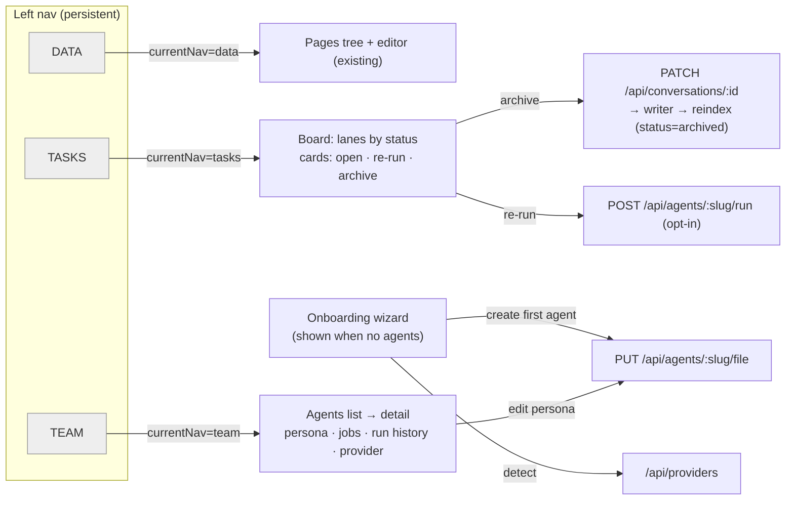

# feat: TEAM/TASKS UX + onboarding (Phase 4)

Phase 4 of the markdown-first refactor. Turns the minimal Phase-3 TEAM/TASKS drawers
into the real Cabinet-style product UX: a persistent **DATA / TEAM / TASKS** left-nav,
a **TASKS board** (conversations laned by status with per-card actions), **TEAM detail**
views (persona editing, per-agent jobs, run history, provider status), and a first-run
**onboarding wizard**. Primarily an `apps/web` change plus one small backend write
(conversation archive) and read composition over existing endpoints.

---

## Problem Frame

Phases 0–3 built the substrate and runtime; Phase 3 added *minimal* TEAM (agents list +
run box + provider status) and TASKS (conversations grouped into vertical lists) drawers,
opened by one-off buttons that toggle `memoryViewOpen`/`teamViewOpen`/`tasksViewOpen`
booleans in a single 2,286-line `apps/web/src/App.tsx`. That's a functional seam, not a
product. Cabinet's value (which this refactor set out to capture) is the **DATA/TEAM/TASKS
left-nav workspace** — a persistent information architecture where pages, agents, and the
task board are first-class sections, plus an onboarding flow that gets a new self-hoster
from empty to a working agent. Phase 4 delivers that UX on top of the existing API/CLI/MCP
surfaces, with the smallest backend additions needed.

---

## Requirements

Traced to `docs/refactor-markdown-first-spec.md` §6 (UI) and `docs/cabinet-deep-dive.md`
§4.4 (nav, lane rules, onboarding).

- **R1 — DATA/TEAM/TASKS nav.** A persistent left-nav section switcher; one `currentNav`
  state replaces the three view booleans. DATA shows the pages tree + editor; TEAM shows
  agents; TASKS shows the conversation board.
- **R2 — TASKS board.** Conversations rendered as horizontal lanes by status
  (Your turn / Running / Done / Failed / Archived) with per-card actions: open (transcript
  detail), re-run, archive. Lanes are a **derived read** of status — no free drag between
  lanes (status reflects the run lifecycle; the only user-set transition is archive).
- **R3 — Conversation archive.** A conversation can be archived (status → `archived`) via
  a lifecycle edit to its transcript file, through the single writer → reindex. Parity:
  API + CLI + MCP + web.
- **R4 — TEAM detail.** Selecting an agent shows a detail view: persona (system-prompt)
  editor, the agent's jobs, its run history, and resolved provider/model — composed from
  existing endpoints (`/api/agents/:slug/file`, `/api/jobs` filtered by agent,
  `/api/conversations?agent=`, `/api/providers`).
- **R5 — Onboarding wizard.** On first run (no agents yet), a dismissible wizard guides:
  detect providers → create a first agent (persona) → optionally a first page → done.
  Persists a "dismissed" flag so it doesn't reappear.
- **R6 — No regressions.** The pages editor, memory view, and all Phase 0–3 behavior keep
  working; files-canonical model, single writer, and API/CLI/MCP surfaces intact.

---

## Key Technical Decisions

- **KTD1 — Incremental refactor, not a rewrite.** `App.tsx` has no test harness and no
  visual-regression coverage, so a big-bang componentization is high-risk. Introduce a
  `currentNav` state + nav switcher and route the existing render branches through it,
  extracting view components only where it's clean and low-risk. Keep the monolith
  otherwise.
- **KTD2 — Derived lanes + card actions, no drag.** Conversation status is derived from the
  run (`running` → `done`/`failed`), not a user-set field. A Kanban with free drag would
  imply arbitrary status edits that don't exist. Lanes are read-only projections; the only
  state transition exposed is **archive** (and re-run, which creates a *new* conversation).
- **KTD3 — Archive is a transcript lifecycle edit (the one write-once exception).**
  Transcripts are written once at completion, but archiving is a status transition (like
  `forgetMemory` on a memory). `archiveConversation` re-reads the transcript, sets
  `status: archived`, and writes through the single writer → reindex. Documented as the
  sole post-completion edit; no content rewrite.
- **KTD4 — TEAM detail composes existing endpoints.** Per-agent jobs = client-filter
  `listJobs()` by `job.agent`; run history = `GET /api/conversations?agent=<slug>` (already
  supported); persona = `GET/PUT /api/agents/:slug/file`. No new read endpoints needed.
- **KTD5 — First-run = "no agents".** The `home` page is always seeded (`ensureHomePage`),
  so "no pages" never happens; the meaningful empty state is "no agents." The wizard shows
  when `agents.length === 0` and not dismissed (a `localStorage` flag), using only existing
  endpoints to act.
- **KTD6 — No router.** Stay state-driven (no React Router) — consistent with the current
  app; URL-driven nav is a possible Phase 5 polish, out of scope here.

---

## High-Level Technical Design

The render conditional changes from `teamViewOpen ? … : tasksViewOpen ? … : memoryViewOpen ? … : (editor)`
to a `currentNav`-driven switch; DATA retains the editor + memory access, TEAM/TASKS become
full sections rather than modal drawers.

---

## Implementation Units

> **Testing note:** `apps/web` has no test harness (no runner; consistent with Phase 2 U8 /
> Phase 3 U14). Web units are verified by `pnpm --filter @company-brain/web typecheck` +
> endpoint behavior, with visual QA flagged as manual. The one backend unit (U3) has real
> `node:test` coverage.

### U1. DATA/TEAM/TASKS left-nav + currentNav refactor

**Goal:** Replace the three view booleans with a persistent nav switcher and a single
`currentNav` state.

**Requirements:** R1, R6. **Dependencies:** none.

**Files:** `apps/web/src/App.tsx`, `apps/web/src/styles.css`.

**Approach:** Add `currentNav: "data" | "team" | "tasks"` (default `"data"`). Replace the
Memory/Team/Tasks buttons (App.tsx ~1315–1326) with a persistent nav group (DATA/TEAM/TASKS,
active state on the current section); keep a Memory entry within DATA (memory stays a
sub-view of DATA, opened as today). Render the pages-tree nav only when `currentNav==="data"`.
Convert the workspace render chain (~1462–1859) from the boolean conditionals to
`currentNav === "team" ? <team> : currentNav === "tasks" ? <tasks> : <data (editor/memory)>`.
`openTeamView`/`openTasksView`/`openMemoryView` set `currentNav` (+ load data) instead of
booleans. Selecting a page switches to DATA.

**Patterns to follow:** existing `primaryButton` nav styling; the current open* loaders
(they already close siblings — fold into `setCurrentNav`).

**Test scenarios:** `Test expectation: none — UI, no harness.` Manual/endpoint: switching
nav shows the right section; selecting a page returns to DATA; memory view still opens;
pages tree hidden outside DATA. Verify typecheck.

**Verification:** nav switches sections; no regression to editor/memory; typecheck clean.

### U2. TASKS board — lanes + card actions

**Goal:** Render conversations as a horizontal status board with per-card actions.

**Requirements:** R2. **Dependencies:** U1, U3 (archive action).

**Files:** `apps/web/src/App.tsx`, `apps/web/src/styles.css`.

**Approach:** Add `.laneContainer { display:flex; gap; overflow-x:auto }` + `.lane` (fixed
width column) + `.laneCard` CSS. Refactor the TASKS branch (~1546–1616) from vertical lists
to lanes built from `TASK_LANES`; each card shows agent + provider + relative time + a
status dot. Card actions: **open** (loads transcript detail into the side panel, existing
`openConversation`), **re-run** (`POST /api/agents/:slug/run` with the card's prompt — uses
the opt-in run API; surface the off-by-default error like U-of-Phase-3's runError), **archive**
(`archiveConversation`, U3). After archive/re-run, reload the board.

**Patterns to follow:** the memory-view two-column `memoryGrid`/`memoryDetail`; the Phase-3
run-error handling (check `response.ok`, show the server error).

**Test scenarios:** `Test expectation: none — UI, no harness.` Manual: cards appear in the
correct lane by status; archive moves a card to Archived; re-run on a disabled run API shows
the error; open shows the transcript turns.

**Verification:** board renders by lane; actions hit the right endpoints + reload; typecheck clean.

### U3. Conversation archive (store + API + CLI + MCP)

**Goal:** A conversation can be archived (status → `archived`) through the single writer,
with full surface parity.

**Requirements:** R3. **Dependencies:** none (enables U2).

**Files:** `packages/agents/src/index.ts`, `packages/agents/src/archive.test.ts`,
`apps/server/src/index.ts`, `apps/cli/src/index.ts`, `apps/mcp/src/index.ts`.

**Approach:** Add `archiveConversation(id, actor?)` to the agent store: read the transcript
(`workspace.readConversation`), `parseConversation`, set `status: "archived"`,
`buildConversationFile`, and `enqueue` a write through the single writer → reindex (mirrors
`saveConversation`; the one post-completion lifecycle edit per KTD3). No-op/return null if
the conversation is missing or already archived. Surfaces: `POST /api/conversations/:id/archive`
(server); `cb conversations archive <id>` (CLI, dual-path, write-guarded); MCP
`company_brain_archive_conversation` (destructiveHint). Reindex sets the `conversations.status`
row to `archived`, so the board + `listConversations({status})` reflect it.

**Patterns to follow:** `saveConversation`/`forgetMemory` (read-modify-write through the
writer); the entity/memory route + CLI + MCP parity patterns.

**Test scenarios:**
- archive a `done` conversation → transcript file `status: archived`, row status `archived`,
  it leaves the active lanes.
- archive a missing id → null (no throw); archive an already-archived id → idempotent (still archived).
- the archived conversation still parses + lists under `status=archived`.

**Verification:** archive flows file → reindex → row; idempotent; parity across API/CLI/MCP;
agents suite green.

### U4. TEAM detail view

**Goal:** An agent detail pane: persona editor, the agent's jobs, run history, provider/model.

**Requirements:** R4. **Dependencies:** U1.

**Files:** `apps/web/src/App.tsx`, `apps/web/src/styles.css`.

**Approach:** In the TEAM section, selecting an agent loads a detail pane (replace/extend the
current run box). Sections: **Persona** — markdown editor over `GET/PUT /api/agents/:slug/file`
(mirror the entity editor: textarea + Save + dirty state); **Jobs** — `listJobs()` filtered to
`job.agent === slug` (schedule, enabled); **Run history** —
`GET /api/conversations?agent=<slug>` (recent runs, click → transcript); **Provider** —
resolved provider/model + detection status from `/api/providers`. Keep the run-prompt box.

**Patterns to follow:** the memory-view entity editor (`entityMarkdown`/`entitySaveState`,
`saveEntityFile`); the Phase-3 providers panel.

**Test scenarios:** `Test expectation: none — UI, no harness.` Manual: editing + saving a
persona round-trips (reload shows it); jobs/run-history list for the selected agent;
provider status shows.

**Verification:** persona edit persists via the file endpoint; jobs/history/provider compose
from existing endpoints; typecheck clean.

### U5. First-run onboarding wizard

**Goal:** Guide a new self-hoster from empty to a first working agent.

**Requirements:** R5. **Dependencies:** U1, U4 (agent create reuses persona save).

**Files:** `apps/web/src/App.tsx`, `apps/web/src/styles.css`.

**Approach:** Detect first run: `agents.length === 0` AND no `localStorage["cb.onboarded"]`.
Show a dismissible wizard overlay (skippable) with steps: (1) **Providers** — show
`/api/providers` detection (which CLIs are installed), with guidance if none; (2) **First
agent** — name + provider select + a starter persona → `PUT /api/agents/:slug/file` (slugify
the name); (3) **Done** — link into TEAM. On finish or skip, set the `localStorage` flag.
Re-openable from a small "Setup" affordance. Uses only existing endpoints.

**Patterns to follow:** the existing project-create inline form; provider/agent-file calls
from Phase 3.

**Test scenarios:** `Test expectation: none — UI, no harness.` Manual: wizard appears with
no agents; creating an agent makes it disappear + the agent shows in TEAM; skip persists;
doesn't reappear after dismissal.

**Verification:** wizard gates on no-agents + flag; agent creation works via the file
endpoint; typecheck clean.

### U6. Board/section styling + empty states + cleanup

**Goal:** Cohesive styling for the new sections and graceful empty states.

**Requirements:** R1, R2, R6. **Dependencies:** U1, U2, U4, U5.

**Files:** `apps/web/src/styles.css`, `apps/web/src/App.tsx`.

**Approach:** Finalize lane/card/detail styling (reuse theme tokens); empty states for
TEAM (no agents → prompt to onboard) and TASKS (no conversations → "run an agent" hint);
ensure the responsive breakpoint handles the board (horizontal scroll). Light cleanup of any
now-dead boolean state from U1. Simplify duplicated fetch patterns if clean.

**Patterns to follow:** existing `styles.css` tokens + the `max-width: 860px` media query.

**Test scenarios:** `Test expectation: none — styling.` Manual: sections look cohesive;
empty states render; board scrolls on narrow widths.

**Verification:** typecheck clean; no dead state; visual QA noted as manual.

---

## Scope Boundaries

**In scope:** the DATA/TEAM/TASKS nav, the TASKS board with open/re-run/archive, TEAM detail
(persona/jobs/history/provider), the onboarding wizard, conversation archive (with parity),
and supporting styling/empty states.

### Deferred to Follow-Up Work
- **URL-driven routing** (React Router; deep links to a conversation/agent) — Phase 5 polish.
- **Component extraction / App.tsx decomposition** beyond what U1 needs — a dedicated refactor.
- **Live run streaming** into the board (cards update as a run progresses) — depends on the
  deferred streaming work from Phase 3.
- **Job create/edit UI** (jobs are authored as files today; a TEAM job editor is a follow-up).
- **`<ask_user>` interactive resume** from the "Your turn" lane — depends on the deferred
  Phase-3 resume work.

### Out of scope (other phases)
- Multi-user auth/RBAC, suggest-changes, presence, per-page optimistic concurrency (Phase 5).
- Visual regression test harness for `apps/web` (worth its own setup; flagged, not built here).

---

## Risks & Mitigations

- **No web test harness → regressions invisible to CI.** Mitigate with the incremental
  refactor (KTD1), strict typecheck, endpoint smokes, and explicit manual-QA call-outs;
  avoid touching the pages-editor internals.
- **Archive vs write-once invariant.** Archiving edits a committed transcript; bounded to a
  single `status` transition through the writer (KTD3), idempotent, and documented as the
  sole exception — not a general transcript-mutation path.
- **Re-run from the board triggers host execution.** Re-run uses the off-by-default run API;
  the board surfaces the disabled/401 error (same handling as Phase 3) rather than failing
  silently.
- **App.tsx size.** The file is already large; U1 adds nav state without growing complexity
  materially, and U6 trims dead state. A full decomposition is deferred, not attempted mid-phase.

---

## Sources & Research

- `docs/refactor-markdown-first-spec.md` §6 (DATA/TEAM/TASKS UI), `docs/cabinet-deep-dive.md`
  §4.4 (nav, lane rules, onboarding) — the product shape being ported.
- Current code (mapped): `apps/web/src/App.tsx` (state block, open* loaders, render chain
  ~1462–2280, nav ~1273–1459, `TASK_LANES` ~171–177), `apps/web/src/styles.css`
  (`.shell`/`.sidebar`/`.workspace`/`.memoryGrid`/`.memoryItem` etc.; no kanban classes yet),
  `apps/web/vite.config.ts` (no router; `/api` proxy), `packages/agents/src/index.ts`
  (`saveConversation`/`listConversations`/`getConversation` — archive mirrors these),
  `apps/server/src/index.ts` (conversation + agent routes; `?agent`/`?status` filters exist),
  `packages/pages/src/index.ts` (`ensureHomePage` — home always seeded, so first-run = no agents).
